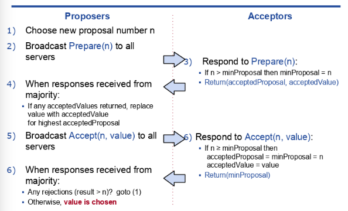
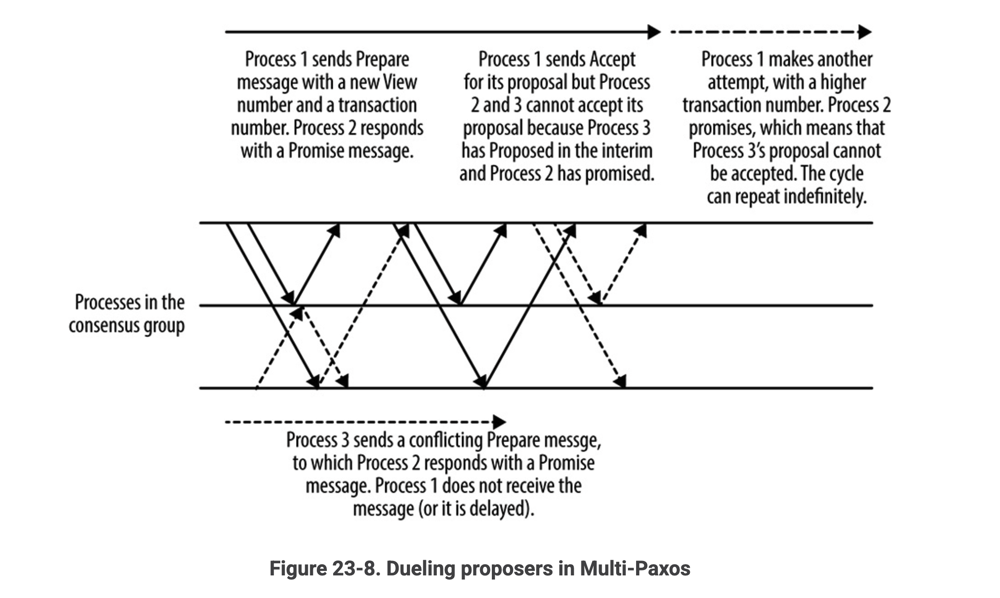
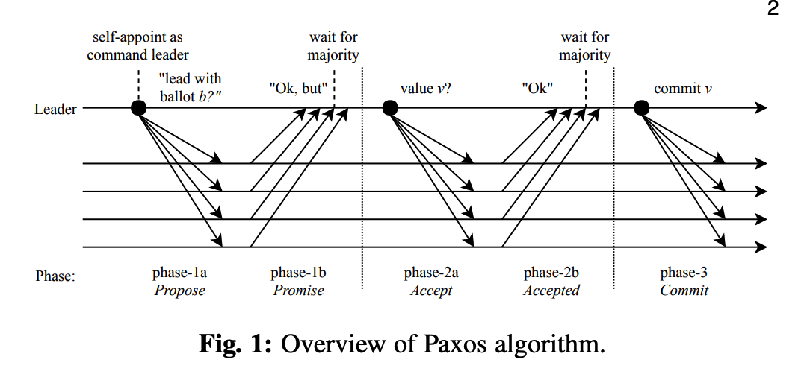
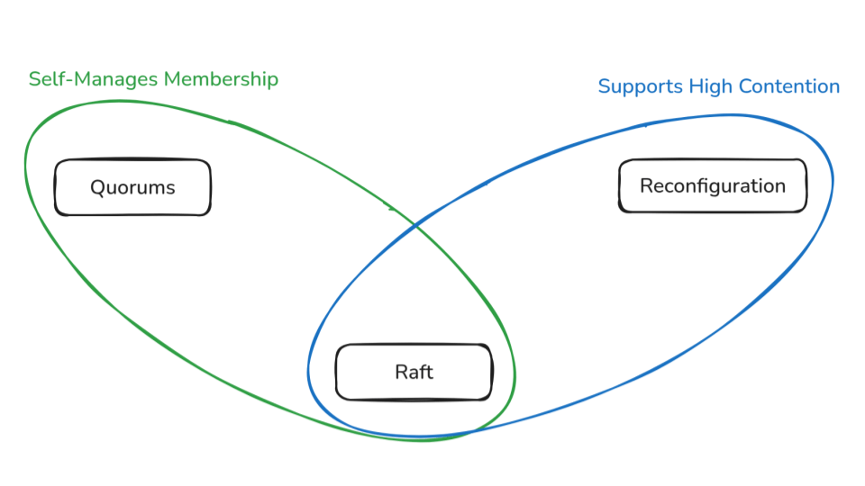
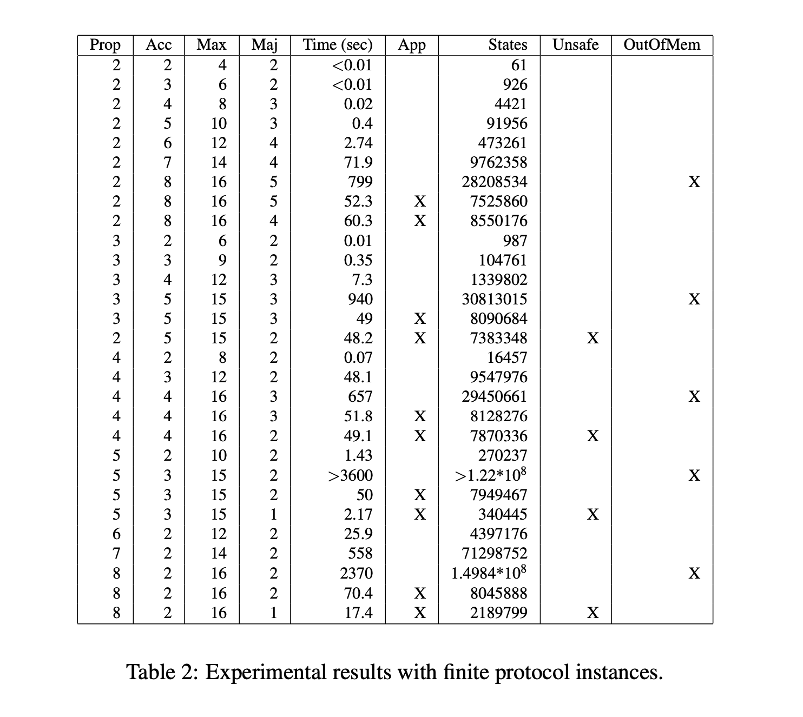

spin_paxos
==========

Above: Paxos (single round, aka Synod) in a single slide.
(slide from: https://uvdn7.github.io/understanding-paxos/ )

This repository contains extracted and updated
Promela models (for running on the Spin model
checker https://spinroot.com/ ) from the
2014 paper: "Model Checking Paxos in Spin"
by Giorgio Delzanno, Michele Tatarek, and Riccardo Traverso

which is available here in PDF
https://arxiv.org/pdf/1408.5962

and below in markdown.

This paper was a great help to me in learning Promela.

Delzanno et al give us a master class in how to 
optimize Promela models by minimizing state space.

The Promela language evolved a little in the
last 11 years, and so I've updated the model files
in small ways to get them to compile, and fixed all
issues that resulted from the update.

In the rest of this README, I'll describe
how to check the models with Spin, give an introduction
to the theory and practice of Paxos, give pointers to the 
Paxos literature, and discuss the design trade-offs involved in
the many variations of Paxos available for
a given use case. The full Delzanno et al paper appears
at the end.

checking the model with spin
------------------

The included makefile shows how to do a model-checking run
on each of these (just type `make` for the optimized; `make unopt`
for the unoptimized model). The optimized model is much faster,
about 2 seconds, versus ~60 seconds for unopt.

Spin is a great, old-school unix style C program that
installs easily using the instructions from https://spinroot.com/

In an epic design choice that I admire deeply, Spin
works by generating a C source code file from 
your .pml (.p) Promela file. This output file is
called pan.c, and you then compile pan.c to just
`pan`, and run the `./pan` executable
to check your model.

All this is just to say, you are going to need
a C compiler like gcc installed, 
since it will be called every
time you check a model by running `make`.

why model check your implementation?
----------------

Distributed systems and Paxos variations are 
notoriously unintuitive under all possible state
transition interleavings, and thus "hand-rolled"
optimizations are easy to get wrong. 

For example, even the published
and model checked variant of Paxos called
EPaxos (Moraru 2013) turned out to have a mistake (Sutra 2019) in its
author's published implementation code and TLA+ model, 
something noted six years after publication.

Sutra writes, "This paper identifies a problem 
in both the TLA+ specification and the 
implementation of the Egalitarian Paxos protocol. 
It is related to how replicas switch 
from one ballot to another when computing 
the dependencies of a command.
The problem may lead replicas to diverge and 
break the linearizability of the replicated service."

Moreover, though Sutra can show there is a problem,
and has proposed a fix, he does not claim
that his proposed fix is correct(!) From
https://github.com/otrack/on-epaxos-correctness :

"Q: Is there a fix?

A: Each process needs to maintain the last ballot 
at which it voted. This requires an additional 
ballot variable in the algorithm. Such an approach 
is implemented in the following repository. The 
correctness of the resulting algorithm has 
not been established yet."

So the problem was not _within_ a single
round of EPaxos, but _between_ the multiple
rounds; a classic location for bugs to creep
in! (and something this spin_paxos repository could to 
be extended to check... but at the moment we
only provided the simplest, most basic, building block.
There are not (yet anyway) any "multiple rounds" of Paxos here.

References for the EPaxos bug:

"On the correctness of Egalitarian Paxos" by Pierre Sutra, 2019.
https://arxiv.org/abs/1906.10917
https://github.com/otrack/on-epaxos-correctness

EPaxos original:

"There Is More Consensus in Egalitarian Parliaments" by
Iulian Moraru, David G. Andersen, Michael Kaminsky, 2013.
https://www.cs.cmu.edu/~dga/papers/epaxos-sosp2013.pdf
https://github.com/efficient/epaxos

On understanding Paxos: an open secret
--------------------------------

Let me provide a hint up front. This is kind of an
open secret about single-decree Paxos. It
represents a paradigm shift in thinking, going
from single-computer systems to distributed systems,
and can be unintuitive.

To me, this is a key understanding that will save you
from many false pre-conceptions if you go in holding
this knowledge in mind. This is it: state is diffused.
State, aka "the most recent version things", is not local anymore.
This sounds obvious, but it is actually subtle. State
has been diffused. You can never blindly trust "just"
the local version ever again. Note you should 
ignore leases and leaders for now.

Because single-decree Paxos is fault tolerant by keeping its most
up-to-date state distributed over a majority (think 2 of 3) nodes,
the "latest" state (which is "just" the state) really is 
_diffused over a quorum_. The latest state cannot be 
determined, ever, by reading 
only a single node. Even for read-only, you _must_ 
read from a quorum to know you have the "latest" state,
because the state is diffused over the quorum. It
does not exist at all on any single node. "Latest"
is always a cluster property of a quorum of that
cluster's nodes, not of any single node alone. 
Realizing this will save you alot of heartache and headache.

In single decree Paxos, the new read that wants
to find the value of the write-once register actually
has to do a write too, not just a read. Why? Because
the state is diffused over the quorum, and due
to partition (message drop) and recovery, the
only guarantee is that after learners hear from a
quorum, then that is the singe consensus value. 

This read-turned-into-a-write is
actually a critical component of the protocol,
that preserves the invariant that only a single
value ever reaches consensus, even with all nodes
acting locally on only their local information. The
safety/correctness "emerges" from their joint
actions, even though it is not obvious immediately, locally,
when that has happened. From the "god's eye" view
of looking at all three machines in an example cluster,
when we see a quorum of two acceptors persist the
same accepted state to disk successfully, we 
know that consensus value has been chosen. The
acceptors themselves do not know this. The
learners collect a quorum of acknowledgements
and then they know it. Could they then proceed
to mark that version of the value locally as the
chosen one, saving any future reads/writers from
going through the whole protocol? Sure, but single
decree Paxos does not do this. It would be one
of a plethora of optimizations possible. So keep
that in mind: there are "obvious" optimizations
that would translate the diffuse state into
local state in single-decree Paxos, and you might
blithely assume that, of course, this is already
done, but beware: it is not. In single decree
Paxos, state is diffused over a quorum. 

Here is an example that shows how a read from a 
single replica node is insufficient. Suppose one node
in a three node cluster is returning from being partitioned off
by itself; it might be severely, or only a little
bit, out of date. Either way, it will serve you
a stale read. In order to get a consensus
read, you have to read from it AND another of the
two nodes. A quorum read is required to not be
served a stale read.

So supposing we apply the "obvious" optimization
described above, and also mark our register as
chosen, once it is chosen. 

Then we start to think about multiple registers, getting into multi-paxos,
so now we have an array of registers, each called
a slot, some of which are marked chosen, some of which might still be
in the process of being chosen. 

Again the question arises, how can we be
sure which slot of chosen values is the latest? Again the diffused
state principle helps us out. If we only read
a single replica's idea of the latest committed
slot, we might be stale. That node might be partitioned
from the quorum and thus in a minority. Other nodes
in the quorum may have gone far past the local
slot array of chosen values. If we pick what we "think" is
the latest from a single node (remember we 
are ignoring leases and leaders for now; in fact this is
the motivation for why multi-paxos wants a leader
with a lease...), we are always vulnerable to reading
from a minority node that does not know yet that they
have been cut off in a partition (equivalent to lost messages).

State is diffused over a quorum. Say
it with me, "state is diffused over a quorum".

Leaders and leases offer a way to trade off some
availability upon node failure (less frequent)
for some happy-path (more frequent) read optimizations. 
How can the leader know that the diffused state
has been correctly cached locally? If it has an
unexpired lease from a quorum of nodes, that
is their guarantee to not participate in any
quroums other than those proposed by the leader,
during the lease time. They must be actively
ignoring/rejecting other leaders during the lease time.
A minority (patitioned scenario) must not be able to
think they have an overlapping lease, because
they would serve stale reads. This is why the
lease itself must be confirmed through
the consensus process itself. If you do not have consensus
on a lease, you do not have a lease at all!

When studying single-decree Paxos (Synod), it is best just to
ignore leaders and leases, and tuck such 
optimizaitons away in the back of your mind.
First learn single decree Paxos. Then you will
readily understand the motivation for leaders and leases. 
For now, leaders and leases, and in fact
many other possible optimizations, are not 
in the picture.

Some good introductions to Paxos
--------------------------------

0. [Lampson 1996 local copy](lampson_1996_how_to_build_ha_consensus.pdf)

https://www.microsoft.com/en-us/research/wp-content/uploads/1996/10/Acrobat-58-Copy.pdf

Butler Lampson's 1996 paper, "How to Build a Highly Available System
Using Consensus", is by far and away the best
paper to read to understand Paxos. It gives both the
practical side and the theory side in easily digestible
steps. The big bonus of learning the theory is that 
it shows how to prove (in the theoretical sense of a math proof)
that your implementation _and its optimizations_ are still correct,
without needing a model checker. This is not to say
that you shouldn't model check your algorithm, but
a proof using the technique that Lampson teaches will be faster,
stronger, and will (hopefully) prevent you from making
"accidental" buggy deviations, because you will know which 
invariants you must maintain.

Sure, your new, cool variant algorithm might still be 
correct even it cannot be mapped back to Paxos, but you'll
have to prove that _all on your own_; a fraught prospect
compared to relying on bedrock Paxos.

As a bonus, Lampson teaches hierarchical leases.

I'll quote that section, because it was new to me, and
because it suggests a very practical idea. Hierarchical
leases are important because leases are the most common antidote 
to the livelock "problem" inherent in basic (leaderless) Paxos.
I put "problem" in quotes because it is the other side
of the high-availability coin. It is hard to get one
without the other. Leases, and for a big cluster, a
hierarchy of leases, solve this dilema while making 
the common happy-path fast at scale. They trade off
a little availability (wait for the lease to timeout
that was held by a dead master) for alot of live-lock 
contention avoidance that yields high throughput
when not in recovery mode. 

> 2.3 Hierarchical Leases
>
> In a fault-tolerant system leases [jea: _if_ leases are used] 
> must be granted and renewed by running consensus. If
> this much use of consensus is still too expensive, 
> the solution is hierarchical leases.
>
> Run consensus once to elect a czar C and give C a 
> lease on a large part of the state.
> Now C gives out sub-leases on x and y to masters. 
> Each master controls its own resources. The masters 
> renew their sub-leases with the czar. This is cheap since it
> doesn’t require any coordination. The czar 
> renews its lease by consensus. This costs
> more, but there’s only one czar lease. Also, 
> the czar can be simple and less likely to
> fail, so a longer lease may be acceptable.
> Hierarchical leases are commonly used in 
> replicated file systems and in clusters.
>
>    By combining the ideas of consensus, leases, 
> and hierarchy, it’s possible to build
> highly available systems that are also 
> highly efficient.

Note: there is a minor typo in the example table
of section 6.4. In the lower left quadrant,
"8 if a, b or b, c report" should
read "8 if a, b or _a_, c report". The
descriptive text above the table has it
stated correctly, so this confusion
is easy to resolve as a typo.

In my view, leases are needed at scale but are
way over-used. They add a ton of costly complexity.
We next look at how simple a system can be when
it just implements Paxos without leaders and without leases.
CAS-Paxos gets its comparison-winning highest
availability by going leaderless.

1. CASPaxos: Replicated State Machines without logs, by Denis Rystsov.

https://arxiv.org/abs/1802.07000

Notes: a great, readable intro, and straight forward
to implement. Just don't believe that when he says "look Ma,
no logs needed!" that you can forgo saving state to disk.
CASPaxos doesn't implement a replicated log (multi-paxos)
which simplifies things tremendously, but that
doesn't mean that saving state to disk is optional.
Without saving state to disk
in Paxos, you will not get safety or linearizability
on node crash + recovery.

That said, omitting logs from the discussion to start with 
is a _great_ idea for learning the essentials first.

On going leaderless, as CAS-Paxos does: 
be aware that the live-lock problem
is real, and you'll need to add exponential back-off
_with jitter_ if you don't use master election with leases; even
then your throughput on contention may slow you down.

This can be worthwhile trade-off for a rarely
changing service, getting simplicity of implementation in exchange for
proposers having to re-try (possibly forever, but
practically a time-out can be returned). 
When we do have a mostly static, rarely-written
and mostly-read service (like configuration/group 
membership), meaning we don't change it much, the service can simply 
alert on an update, making full read Paxos cycles unnecessary and 
then only the much less common writes would contend.

Of course clients still have to poll once on their
startup and to establish a change-notification channel,
(and probably heart-beats too).
Startup and restart are comparatively rare, so
to me this is a big win for simpler and smaller code.
I use this approach in my own systems to keep
the implementation compact and readable. Leases induce
a massively more complex protocol. 

The only trade-off here is that any read client 
that doesn't do the full round of Paxos themselves
is vulnerable to not having the very latest update by the time they
get the message (due to network message delay,
an update could have been applied
"after" the one we get and "before" the
client message arrives).
This however is inherent in all distributed
systems (see relativity in physics) -- and 
especially those that cannot
afford everyone running consensus and so 
use a central coordinator cluster 
(e.g. Chubby at Google/etcd in Kubernetes), 
and is mitigated both by TCP's properties and clients simply telling 
their heartbeat partner about their latest version
and getting any newer/latest update to the 
consensus value on the return beat.
This works well for small configuration state 
that easily piggy backs on the heartbeat. It
is a "lightweight" polling-by-proxy mechanism,
suitable for slowly changing configuration.
Like humans, the client still only ever sees values that were correct
at some point in the past (a few milliseconds
ago for the trip between light reflecting off
an object, hitting the eyes, and the signal being 
transmitted to the brain). Clients might 
be slightly behind, but are always safely correct.
We assume that the proxy (member of the
Paxos coordination cluster) itself does
regular reads through the full system, to
detect partition and stay up to date; and
only tells the client if something has
changed with respect to the version in the
client's heart-beat check.

Also note that re-tries after back-off are still
programmer-convenient in that 
clients can be blissfully unaware of the back-off
and re-try happening under the covers on the
proposer side (clients just wait longer, rarely
getting a full time-out error). 

To summarize the live-lock versus leader-election and 
lease timeout issues, I'll quote https://sre.google/sre-book/managing-critical-state
(under figure 23-8 picturing dueling proposers; 
in the "Multi-Paxos: Detailed Message Flow" section,
reproduced below) which makes the point 
that for systems that actually
do need to support alot of writes, you'll probably
need the complexity of leases.

> All practical consensus systems address this issue 
> of collisions, usually either by electing a proposer 
> process, which makes all proposals in the system, or 
> by using a rotating proposer that allocates each 
> process particular slots for their proposals.
>
> For systems that use a leader process, the 
> leader election process must be tuned carefully 
> to balance the system unavailability that 
> occurs when no leader is present with the risk 
> of dueling proposers. It’s important to implement 
> the right timeouts and backoff strategies. 
> If multiple processes detect that there 
> is no leader and all attempt to become leader 
> at the same time, then none of the processes 
> is likely to succeed (again, dueling proposers). 
> Introducing randomness is the best 
> approach [jea: you _really must use jitter_ 
> if you do the exponential-backoff leaderless approach]. 
> Raft (Ong14; https://raft.github.io/ ), for example, has a well-thought-out 
> method of approaching the leader election process.

Final note on CAS-Paxos: I would ignore Rystsov's 
group membership change protocol, at least on the first pass. There
are more scalable approaches than doing membership
changes one-by-one. In fact, Lamport himself describes 
an approach for arbitrary membership changes in the second-most 
important paper in this list (after Lampson), which I describe next

2. Paxos Made Simple, by Leslie Lamport. 2001.

https://lamport.azurewebsites.net/pubs/paxos-simple.pdf

Note A: This is the 2nd paper Lamport wrote about Paxos,
the one that does _not_
use an elaborate conceit about an ancient Greek parliament.
It is very clear, and you should not be afraid to read
it for an authoritative and correct presentation 
of the algorithm. Many other summaries that I've read
get subtle details wrong, actually. So stick with
Lamport's simple and clear description.

Here is a nice summary diagram from a more recent
paper on a paxos variant (there are dozens). 
You can see immediately that Paxos is
really similar to the the classic two-phase commit
protocol for distributed database transactions.
In fact, that is all Paxos is, really: 
a new "prepare" phase, followed by a two-phase
commit that yields a three-phase (5 message
delays) protocol that is fault-tolerant.
It's the correctness proof part that is really 
the harder part; that and keeping 
the difference between `<` and `<=` in mind.

Also, don't let the 5 delays put you off. This
is just the baseline "classic" version. In
the typical optimizations (like running
multiple rounds (multi-paxos) where phase 1 does not
need to be repeated after electing a leader for
a given epoch; and/or using leases; combining learners and acceptors
into the same node), these delays are reduced substantially 
or even eliminated all together.

Overview of Paxos From https://arxiv.org/pdf/1703.08905 "WPaxos: Wide Area Network Flexible Consensus" by Ailijiang et al. 2019. Figure 1, page 2.

getting at the intuition behind Paxos
------------------------

Let's take a brief but deep dive into single decree Paxos,
also called Synod.

Really the only tricky, subtle, part of Paxos is
in phase one: the Proposer can
have a value in mind they want to write, but if
even one Acceptor in the quorum comes back with an already accepted/committed
value, the propser must SUBSTITUTE the returned 
value for this write, in place of the one they originally
had in mind -- and then still use the original ballot number
that they had proposed/gotten promises back for.
Systems can simply automatically re-try a delayed write
on the next instance of Paxos, but conceptually
that gets into multi-Paxos, which is beyond
this next discussion: a focused exploration of basic Paxos.

(I generalized a little too much just there.
Technically, the Proposer has to substitute the value with the _highest_ 
number of all accepted/committed values seen by Acceptors).
Interestingly, this value the acceptors give us, 
assuming it is not-nil, is like Schreodinger's cat.
We don't know if it is alive or dead (chosen or not) just from
the quorum of prepare responses. If we happen to get lucky, or
if we willing to wait for all nodes to be up, then
we could tell after the prepare phase. In
general we don't know for sure, so the classic Synod approach
keeps it simple and doesn't try to optimize for
the lucky break read--also usually we prefer to chop off our tail latency
by getting the minimal necessary quorum of
responses, rather than wait around who-knows how
long to see if we can avoid the cost of 1.5 more network round-trips.

The first phase of Paxos then is about
_recovery_ after crash/reboot and still keeping a
locked in "chosen" value locked in. We don't
want it to "break out" and suddenly change its
value.
The later is the essential safety property of basic Paxos,
which is akin to a write-once register. 
In this analogy, we read the register first to make sure it hasn't
already been written. Once we successfully
write to this register, the register's 
value is locked in, and will never change
in the future, assuming the protocol is followed.
We might overwrite the value, but if we do,
it will be with the same value (just a 
higher ballot number).

What does a successful write entail? 
We must get a quorum of acceptors to write the
same value to stable disk, that value will
never change in future ballots (for a single
instance of Paxos), even if we over-write
it multiple times through the Paxos state
machine. Once chosen, the value is idempotent to
higher future Paxos ballots. Lower ones
are ruled out by the promise-to-ignore
them mechanism. Of course, higher
ballots will re-write the same value 
under a new ballot number, but the chosen value
itself doesn't change after on-disk acceptance
by a quorum. That is what allows messages
to come in late or be duplicated, and not
mess things up. Nodes can crash and restart,
and miss messages, but the register is 
idempotent; locked-in.

So the Paxos protocol prevents changing the
value once chosen. Interestingly, chosen
is not a property of a single node, but
only of any subset of nodes >= quorum. That is, in the 
original, no single node knows by itself
that the register has been locked.
The "reads" and "writes" we discussed
in the register metaphor were in reality
parallel interactions with at least a 
quorum for the reads (in phase one), 
and a (possibly different) quorum for 
the write accept phase two.

This suggests a simple local-read/write optimization
that does not even need leases, and could
reduce the conflict rate in a leaderless one-Paxos
instance scheme: 
the learners (assuming they are colocated
with the acceptors, as is usually done) could simply
include a "locked-in", "fixed", or
"chosen" flag alongside their locally stored value.
The flag caches 
whether or not this node's value has seen
acceptance quorum. Since the chosen value
cannot change later, it is ideal
for caching. By turning a quorum property
into a local flag, reads can be served
from local storage, and new writes can be rejected
immediately if the flag is set. 

The learner could simply set the flag once quorum
is noted. Notice however that not
all nodes may be up when the learn
messages come through, so they may
miss the moment when the flag is
announced. So the flag never has
false positivies, but it can have
false negatives. If the "chosen"
flag comes back true we can trust it.
If it comes back false, we cannot.
If we check our local cache and 
"chosen" has not been flagged, we
must proceed to do a full quorum
read, and then check for the flag.
Again we can finish early at that
point if all we are doing is read.
If the quorum read tells us the
value is already chosen, we 
can also short-circuit writes
at this point. There's little
point in re-writing the same
value again at a higher ballot
number, and there's no point
in trying to write a different
value, since it won't work.

How about nodes that were crashed
when we learned about the chosen status?
They won't know that a 
value was chosen, and so won't
know to set their "chosen flag".
Thus they might run a round on recovery
to find out.
If we use the flag optimization
suggested above, then this makes
it much easier for a recovered node to also query
for the "chosen" flag during prepare,
since given the quorum from prepare
at least one response will include
the flag if a previous quorum
wrote it to disk, which would
then be definitive if the flag was set to true.
There is a race for the query to happen
after the chosen moment and before the
learners write the flag, so the
recoverying minor node might end up doing
the full round and re-writing the same
value, but the algorithm guarantees
the re-write will indeed be the same
value that was chosen. The flag just
avoids this extra round except in this
rare race condition; but the recovery
process must be prepared to finish
out the full round of single decree Paxos.

As above, this allows short-circuiting/avoiding the
Paxos network costs (most all of the time) because we
can conclude immediately after
one (parallel to all member) round trip.

For intuition into how the original algorithm was 
arrived at, see the #on_ballot_numbers
section at the end of this file for a 
choice quote from Lamport.

The other two phases are a very straight forward
version of two-phase commit. You just
have to remember to not respond (or respond with
a conflict message--in yet another optimization atop
the baseline; there are so many of these!) if you run into a promise
higher than your current ballot.

On livelock prevention: "Wakanda Force-field Dome Up!"
--------

A consensus example (a write once register) from biology
serves as inspiration.

I'm thinking about the way an unfertilized oocyte
prevents multiple spermatozoa from fertilizing it.

Like the Wakanda force-field shield dome snapping on,
the very first fusion of sperm and egg says, "shields up!"

Zona pelucida image from
https://embryology.med.unsw.edu.au/embryology/index.php/Zona_pellucida

The egg almost instantaneously creates a 
protection barrier -- not unlike how the earth's
atmosphere protects it from cosmic rays. The first
sperm to wiggle through the zona pelucia causes a massive wave
of calcium release to flash through the plasma of the oocyte,
signalling (broadcasting to all receptors) on the entire 
egg surface that the first sperm has arrived, and 
inducing depolarization at the zona pelucida 
that locks out other sperm. This is called the fast block
to polyspermy.
https://en.wikipedia.org/wiki/Zona_pellucida

This is how cells prevent multiple fertilizations,
aka polyspermy, which would be a genetic disaster
(almost invariably lethal) for the just established zygote. See 
the "Fast and Slow block to polyspermy" in 
https://en.wikipedia.org/wiki/Oocyte_activation
https://www.youtube.com/watch?v=BFrVmDgh4v4
https://www.youtube.com/watch?v=n036ktJ9_ro

Back to Paxos

The strangest thing about the basic single instance 
Paxos livelock of dueling proposers is that it feels 
entirely pointless and unwarranteed,
as it makes no attempt by default to block other
proposers after the first, even for a few moments.
Again we are pre-viewing the motivation for leases
and leaders.

Review the 23-8 figure above again. 

Shouldn't we at least let the first proposer to arrive
try to finish their business before interrupting them?

Why not just start a timer when you get a proposal, and
reject any other proposer until the timer expires?
The first proposer can of course fail at any time
and cease to finish his round. So we cannot wait
on them forever.

Lets call it "automatic leasing" -- which is appealing
because no renewals are needed. (I implemented
leases and lease renewal at one point... and Ugh. I tore it out
about because of the large added complexity).
If you can do without leasing, the protocol is 
much simpler, and should yield more easily to verification.

We could shorten "automatic leasing" to "auto-leasing", 
but then it sounds like a used car sales lot. Let's
find a different name.

"Fifo-leasing with queuing" sounds better. Just like how a
lease is a lock with automatic timeout, fifo-leasing 
is like a mutex or monitor: we have a queue in the background,
and the currently active propser has a lease whose
timeout signals we should let the next proposer try.

First come, first served: In this fifo-leasing scheme,
the proposer doesn't even need to manage leases or be aware
that they have a lease. This simplicity is great,
especially because no leader election needed.

In fact the acceptor could just delay responding
to any conflicting proposal until the first
proposer completes, or their timer expires.
For fairness, the acceptor can then respond to
the next proposer in their queue, in FIFO order,
providing some degree of fairness while
stopping many pointless dueling livelocks.

The difficulty arrises with not
all acceptors agreeing on which of competiting "first"
prepares that each arrive at first 
different acceptors, having come from different
proposers. In the Synod prepare phase, 
acceptors reject lower than promised ballots, but promise
for >= ballots. Two acceptors can fifo-lease
to two different prepares in phase 1, so both defer 
replying to the other's promise requests. If
each node gets involved in a different lease,
nobody makes progress until all leases have
expired and we try again. We are still live locking,
with the added chagrin that actually we are all
asleep waiting for the proposer to get a prepare-
quorum that will have to wait for lease expiration.

By network equivalence or a filtration argument
in Paxos, any change that is equivalent to
dropping or delaying packets does not
change safety, since we already know Paxos
is safe against drops and delayed messages.
Essentially holding a lease (lets call the 
lease holder a "leader" now, even if there was
no official election phase) is delaying the
network messages from all other proposers until that leader's 
lease expires without renewal, fitting all the leaders work into the time
before that happens. The lease does time 
dilation, in effect.

Let's try adding fifo-leasing during phase 2 instead of phase 1.
The main thing about phase 2 is that can start
being aware of the prepare-quorum from phase 1.
We get the possibly chosen or maybe-not-chosen value, or a new value 
to write, along with the ballot to write it under.
We'll get conflicted out if we have seen a quorum of higher
ballots in the meantime. We cannot "go back in time"
and erase our prior promise about a higher ballot,
pretending to drop or defer that message,
because the higher ballot proposer has already 
heard our promise; otherwise it would not have
sent us a second 2a. It might have sent us a 1a,
which we can defer, but we cannot defer a 2a.
So the lease holder needs to distinguish between these two types
of conflict, that from 1a and that from 2a.
Does this get us out of trouble?

Having an acceptor queue the second or later arriving
proposal once a fifo-lease is in force instead of 
recording it immediately as a promise is a delay, 
and if that acceptor fails before it gets to it,
then the delay becomes a dropped message. So
fifo auto leases preserves correctness (safety),
but only assuming a quorum knows about the fifo-lease, and 
has promised to repsect it. This motivates why
any lease has to go through the consensus process
itself to become established with a quorum. We
cannot assume anything based on a non-quorum fifo
lease, and so it has to be chosen first. Since
this is equivalent to just doing the round
anyway, it doesn't actually offer any optimization.
It is not a shortcut. In order to lease, we
also need consensus on the leases. Leader election
with the leader holding a lease may be stronger
than we need (EPaxos tries hard to avoid it,
for WAN optimization), but it does ensure correctness
and might be the simplest among possible solutions.
EPaxos adds alot of complexity, and as above, we are
still not sure that it is correct.

3. "Revisiting The Paxos Algorithm" by Roberto De Prisco,
Masters Thesis, MIT, 1997.

https://dspace.mit.edu/bitstream/handle/1721.1/42777/38529302-MIT.pdf

Notes: goes much more into multi-paxos (which is just
multiple iterations of the Synod protocol described
above and in our Promela files),
and the time-outs required when messages might be lost. 
Lamport sketches how multi-paxos works
to do full State Machine Replication (SMR) in 
the "Paxos Made Simple" paper, 
but the details are fully fleshed out and proven here. This is the
first place where the term Multi-Paxos is used, as far
as I can tell.

4. "The Part-Time Parliament" by Leslie Lamport. 

"This article appeared in ACM Transactions on Computer Systems 16, 2 (May 1998), 133-169. Minor corrections were made on 29 August 2000."

https://lamport.azurewebsites.net/pubs/lamport-paxos.pdf

Notes: I actually don't recommend starting here. The
conceit of this algorithm being "discovered" by an
archeologist, and expressed mostly in terms of an
extensive metaphor for a Greek parliament, makes it hard to follow.

This is the widely acknowledged reason for the idea that Paxos is
hard to understand. So, you should be aware of this paper so
you know _why_ it was considered hard to understand
(and to this day, maintains that reputation), but
if you start with 1) or 2) above, you'll be fine.

If in doubt, read the unopt.pml model file. It
gives you exact, precise code (not ambiguous English!)
for a single round of Paxos (one Synod
iteration) in about 200 lines, including comments.

More importantly, you yourself can make changes (like setting MAJORITY
to 1 instead of 2, for 3 acceptors) and then re-run 
the model checker to see the path to the 
correctness violation (not all nodes agree
on the chosen value) very quickly. The importance
of doing this yourself, in a hands-on experiment,
cannot be overstated.

Note: the years of publications may seem confusing.
Lamport also originally published Paxos as a DEC technical
report in 1989, in the Greek story form. The
editors of the submitted journal version refused
to publish it for some (eight??) years. Meanwhile
Butler Lampson popularized it by giving talks
on Paxos and explaining it's value. Lamport of course
went on to win the Turing Award in 2013 for his
body of work.

On Raft
-------

After you understand Paxos, you'll probably view
Raft as just another Paxos algorithm variant, albeit one
tightly specified, leaving little room
for ambiguity or discretion in implementation.
Given how much wiggle room there is for 
variations and optimizations (instrinsic, of course
to the algorithm being fault tolerant is that
it is also very change tolerant; that is,
until it isn't!), Raft was a brilliant
stroke, and sorely needed. Locking 
down an exact algorithm with a precise set 
of choices that could eventually be proven
correct was a massive boon to the software engineering
community. For more on this thesis and a deep comparison
of Paxos and Raft, see https://arxiv.org/abs/2004.05074 
"Paxos vs Raft", by Heidi Howard and Richard Mortier, 2020.

As a counter-point though, "Enough with all the Raft", 
https://transactional.blog/talk/enough-with-all-the-raft
is a great, recent, 10 minute talk from Alex Miller (Google, FoundationDB)
that got me thinking about Raft versus other
Paxos configurations. He makes a reasonable case 
that Raft is often a mediocre,
but safe, choice; if you understand your problem
space and the trade-offs involved, you can
make better choices when they are available.

Alex's recommendation of CAS-Paxos as a good "weekend project"
place to start is one I'm repeating here.

That said, having now read the alot of the
literature on Paxos based reconfiguration, and
compared it to the Raft paper's approach,
I would have to say this to try and persuade
you to use Raft for your Czar or master for
handling configuration of itself and for a
larger cluster. The Raft approach
is safe, sane, proven and has an easy
recipe for implementation. The Paxos
based approaches to reconfiguration are sketched
without proofs, not well thought out, 
and not fully analyzed. With full irony,
there is no consensus among them on 
how to reconfigure.

For a re-reconfigurable cluster (that is,
all clusters -- all real clusters need reconfiguration in
reality as nodes die and need replacement),
you either shut it all down and fix it all at
once, taking a large service window (outage),
and involving a manual syadmin, or you find 
an automatic online reconfiguration 
protocol that actually has theoretical and
machine checked safety proofs.
After doing the research, the clear vote is for Raft.
To me, having solid reconfiguration just over rules
any other (performance) concern. If I'm
just looking to provide a replication Czar
or master for other services, performance is
not on the hot path, and storage concerns
are irrelevant for the tiny amount of state
involved in configuration. So to answer
Alex's query about what is Raft the best at?
Reconfiguration.

He acknowledges this in the blog:

> "There is a correct counter-argument here, 
> and it’s that you cannot solve consensus with 
> two failures using three nodes. So when raft 
> is electing a new leader or changing its replicas, 
> it can do that itself. Reconfiguration-based 
> replication needs some external consensus 
> service to lean on."

Above, Raft image from https://transactional.blog/talk/enough-with-all-the-raft

Raft is the best at re-configuration, in my mind, 
not in small part because it is a stand alone solution. 
It does not push the problem off to another 
external (Paxos) service rather than 
taking responsibility and solving it itself.

We've got to maintain and update membership, 
so delegrating the real work elsewhere just adds
dependencies and to my think, is a cheap ducking
of responsibility.
Raft actually has an integrated, sane, proven 
approach to reconfiguration. Sane reconfig isn't a 
steady state property, it isn't on the hot 
data path, but that doesn't make it less 
worthy of consideration or of
affecting our choices. 

In discussions of configuration there can be two clusters
being talked about, and this is a distinction that
can get lost in Alex's argument. There is
the five node central Chubby/etcd cluster itself, and then
there is the larger cluster that depends on it.
For my purposes, and conclusions, I have small clusters, 
and want simplicity, so I'm merging them into the same set of service nodes.
Note this is optional, much simpler, but not scalable
to a > 9 node cluster. Its not hard to separate out again
the roles, when need be.

To sum up, "configurability" should
be a foundational metric for judging algorithms; it
is a central and critical property that most
Paxos variant papers just don't address well,
if they address it at all. Because machines 
fail all the time, you'll need this feature
much sooner than you think. Jump on the raft, 
and survive turbulent waters
when the cluster membership changes. 

------------

Repository owner: Jason E. Aten, Ph.D.

My contributions are copyright (c) 2025, by Jason E. Aten, Ph.D.

License: Creative Commons Attribution License, per the paper below.

------------

What follows is the Delzanno et al. 2014 paper, 
"Model Checking Paxos in Spin",
translated into markdown (pure text).

The authors provide a realistic and tractable 
model for single-round Paxos, one of the most
useful and important of all distributed systems algorithms. 

While doing so, they give us a master class 
in how to optimize Promela models by minimizing
state space. They exploit details of Spin's
implementation that I have not seen discussed
elsewhere (see below). The results speak
for themselves: optimized model checking one
round of three proposers and three acceptors
finishes in about 2 seconds on my computer.
Compared to TLA+ models that take _hours_ or even _days_ to check
(if they even finish at all!), this was a revelation.

Notes on corrections, and per the CC-BY license requiring annotation of changes:

There was a minor mistake in the first/unoptimized version
of `rec_p()` using `if :: (prnd>rnd)` and `(prnd <=rnd) −> printf("\nSKIP ")`.
The first `if` test should be `prnd>=rnd` and the second `prnd < rnd`.

This has been corrected, and clearer names applied, in
unopt.pml's `recv_prepare_at_acceptor()`
using 
~~~
if :: ballot >= promisedToIgnoreLessThan // line 118
~~~
and 
~~~
:: (ballot < promisedToIgnoreLessThan) -> printf("\nSKIP "); // line 121
~~~

The pdf linked above and the code shown in the markdown
version below give the original, as published,
Promela code. 

The updated and corrected code is in this repo. See these two files:

The (corrected) unoptimized model is in [unopt.pml](unopt.pml).

The (corrected) optimized model is in [optimized.pml](optimized.pml).

A second correction was applied in the acceptor_optimized() process of the optimized.pml file
[line 193 was missing in the original second/optimized acceptor() proctype](
https://github.com/glycerine/spin_paxos/blob/master/optimized.pml#L193)
The optimized version shown in the published paper 
stalls and completes no rounds without this correction,
as the acceptor does not reply with any phase 1 promise message.

In summary, the included Promela files are my creation,
with lots of renames and upgrades, but these rest on the bones
provided by Delzanno et al.

Paper: "Model Checking Paxos in Spin"
====================

https://arxiv.org/pdf/1408.5962

local backup: [model_checking_paxos_in_spin.pdf](model_checking_paxos_in_spin.pdf)

Authors:

Giorgio Delzanno
(DIBRIS, Università di Genova)

Michele Tatarek
(DIBRIS, Università di Genova)

Riccardo Traverso
(FBK Trento)

~~~
Adriano Peron and Carla Piazza (Eds.):
Proceedings of the Fifth International Symposium on
Games, Automata, Logics and Formal Verification (GandALF 2014)
EPTCS 161, 2014, pp. 131–146, doi:10.4204/EPTCS.161.13

(c) G. Delzanno, M. Tatarek, and R. Traverso
This work is licensed under the
Creative Commons Attribution License.
~~~
(See the #creative-commons-attribution-license-details section 
at the end of this document for license details.)

Abstract
--------

We present a formal model of a distributed consensus algorithm in the executable specification language Promela extended with a new type of guards, called counting guards, needed to implement
transitions that depend on majority voting. Our formalization exploits abstractions that follow from
reduction theorems applied to the specific case-study. We apply the model checker Spin to automatically validate finite instances of the model and to extract preconditions on the size of quorums used
in the election phases of the protocol.

# 1. Introduction

Distributed algorithms are a challenging class of case-studies for automated verification methods (see
e.g. [12, 1, 24, 12, 13, 17, 25, 18, 10, 4]). The main difficulties come from typical assumptions taken
in these algorithms such as asynchronous communication media, topology-dependent protocol rules,
and messages with complex structure. In the subclass of fault tolerant distributed protocols there are
additional aspects to consider that often make their validation task harder. Indeed, fault tolerant protocols
are often based on dynamic leader elections in which quorums may change from one round to another.
When modeling these protocols, one has to deal with a very fast growth of the search space for increasing
number of processes.

Following preliminary evaluations described in [4], in this paper we apply Promela/Spin to specify and validate a fault tolerant distributed consensus protocols for asynchronous systems caled Paxos
[19, 20] used in the implementation of distributed services in the Google File System [3]. Promela is a
specification language for multithreaded systems with both shared memory and communication capabilities. Promela provides a non-ambiguous executable semantics that can be tested by using a simulator
and the Spin model checker. Spin applies enumerative techniques for validating finite-automata representation of Promela models.

In the paper we give a formal Promela specification of the Paxos protocol that is modular with
respect to roles, rounds, and communication media inspired to the presentation given by Marzullo, Mei
and Meling in [20] via three separate roles (proposer, acceptor, and learner). The resulting specification
is closer to a possible implementation than sequential models with non-deterministic assignments used
in other approaches such as [26].

Via a formal analysis extracted from the correctness requirements, which are specified using auxiliary
variables and assertions, we give reduction theorems that can be used to restrict the number of processes
instances for some of the protocol roles, namely proposers and learners. Finally, we design code to code
Promela transformations that preserve the interleavings from one model to the other while optimizing the
state exploration process required in the model checking phase. For this purpose, we introduce a special
type of atomic transitions, called quorum transition, that can directly be applied to model elections via
majority voting. The transitions are defined on top of a special guard that counts the number of messages
in a channel embedded into Promela code using the deterministic step constructor `d_step`.

# 2. Paxos: An Informal Specification

The consensus problem requires agreement among a number of agents for some data value. Initially,
each agent proposes a value to all other ones. Agents can then exchange their information. A correct
agent must ensure that when a node takes the final choice, the chosen value is the same for all correct
agents. In the asynchronous setting, it is assumed that messages can be delayed arbitrarily. Furthermore,
a subset of processes may crash anytime and restore their state (keeping their local information) after an
arbitrary delay. Fisher, Lynch and Patterson have shown that, under the above mentioned assumptions,
solving consensus is impossible [14].

In [19] Lamport proposed a (possibly non terminating) algorithm, called Paxos, addressing this problem. Lamport later provided a simpler description of the protocol in [20] in terms of three separate agent
roles: proposers that can propose values for consensus, acceptors that accept a value among those proposed, and learners that learn the chosen value. Marzullo, Mei and Meling give a pseudo-code presentation of the algorithm in [22].

The Paxos protocol for agreement on a single value works as follows. In a first step the proposer
selects a fresh round identifier and broadcasts it to a (subset of) acceptors. It then collects votes for
that round number from acceptors. Acceptor’s replies, called promises, contain the round number, and
a pair consisting of the last round and value that they accepted in previous rounds (with the same or
a different proposer). When the proposer checks that majority is reached, it selects a value to submit
again to the acceptors. For the selection of the value, the proposer inspects every promise received in
the current round and selects the value with the highest round. It then submits the current round and the
chosen value to the acceptors. Acceptors wait for proposals of round identifiers but accept only those
that are higher than the last one they have seen so far. If the received round is fresh, acceptors answer
with a promise not to accept proposals with smaller round numbers. Since messages might arrive out-oforder, even different proposals with increasing rounds of the same proposer might arrive with arbitrary
order (this justifies the need of the promise message). Acceptors also wait for accept messages: in that
case local information about the current round are updated and, if the round is fresh, the accepted pair
(round, value) is forwarded to the learner. A learner simply collects votes on pairs (round, value) sent
by acceptors and waits to detect majority for one of them.

The protocol is guaranteed to reach consensus with n acceptors up to f = b(n − 1)/2c simultaneous
failures, but only if learners have enough time to take a decision (i.e. to detect a majority). If proposers
indefinitely inject new proposals the protocol may diverge. Under the above mentioned condition on f
and in absence of byzantine faults, correctness can be formulated as follows.

Property 1 

When a value is chosen by a learner, then no other value has been chosen/accepted in
previous rounds of the protocol.

This means that, whenever a value is chosen by the learner, any successive voting always select the same
value (even with larger round identifiers), i.e., the algorithm stabilizes w.r.t. the value components of
tuples sent to the learner. To ensure this property, in the first part of the protocol the proposer does not
immediately send its proposal for the value but only its round number. The proposer selects a value only
after having acquired knowledge on the values accepted in previous rounds. Among them the choice
is done by taking the value of the highest round. Its own proposal comes into play only if all values
received by acceptors are undefined (equal to −1). Other safety requirements are that chosen values are
among those proposed and that chosen values (by the whole system) are the same as those learned by
learners.

# 3. A Formal Model in Promela

In this section we present a formal specification of Paxos given in Promela, a specification language
for multithreaded and distributed programs. Promela thread templates are defined via the proctype
construct. The body of the template (a sequence of commands) defines the behavior of its instances. The
language has a C-like syntax for shared and local data structures and instructions. Guarded commands are
used to model non-deterministic choices in the body of process templates. For instance, the command
`if :: g_1 -> c_1 ; ... :: g_n -> c_n ; fi` specifies a non-deterministic conditional: only one command `c_i`
among those for which the guard gi is enabled is selected for execution. The guarded command `do :: g_1 -> c_1 ; ... :: g_n -> c_n ; od` is the iterative version of the conditional. Data structures include basic
data types (byte, bool, int) as well as arrays and structures. Furthermore, channels can be used for the
specification of inter-process communications. For instance, chan c[MAX], where MAX is a constant,
defines a channel with at most MAX places. A message hm1 , ... , mn i is sent by using the command
c!m1 , ... , mn , where c is a channel and m1 , ... , mn are expressions whose current values are sent on the
channel. Reception is defined via the capability c?x1 , ... , xn , where c is a channel and x1 , ... , xn are
variables used to store the data from the incoming message. Channels can be viewed as global arrays.
The selector ? provides FIFO access, whereas ?? provides random access. To restrict reception to a
given pattern, it is possible to put either a constant value in a reception or an expression like eval(x) that
evaluates to the current value of x. We describe next our first Promela model for Paxos.

A round is defined via a proposer process running in parallel with the other processes (other proposers, acceptors and learners). The proposer proctype takes in input two parameters: a unique round
identifier (a number) and the proposed value. Round identifiers must be unique for the algorithm to work.
Roles can be viewed as threads definitions within the same process situated in a location. Asynchronous
communication is modeled via global channels with random receive actions. We model the majority test
via conditions on counters that keep track of the number of received messages (we do not model message
duplication). Since the protocol assumes that each round is associated to a unique proposer we can use
a local counter for votes received by a given proposer. Rounds are also used as a sort of time-stamps
by acceptors. Indeed they are required in order to fix an order on incoming prepare and accept messages, i.e., enforce some order in a chaotic flow of messages. We manipulate messages inside atomic
actions. A special learner process is used to observe the results of the handshaking between proposers
and acceptors, and to choose pairs round,value. The algorithm guarantees that once a value is chosen,
such a choice remains stable when other (old/new) proposals are processed by the agents. The learner
keeps a set of counters indexed on rounds to check for majority on a value. We discuss next the Promela
specification in full detail. First of all, we use the constants:

~~~
#define ACCEPTORS 3
#define PROPOSERS 5
#define MAJ (ACCEPTORS / 2 + 1)  // majority
#define MAX (ACCEPTORS*PROPOSERS)
~~~

The former defines an upper bound on the size of channels. The latter defines the size of quorums. By
changing MAJ we can infer preconditions on the number of faulty processes.

Using a thread-like style, we consider four shared data structures that represent communication channels. They correspond to different phases of the protocol. The message signature is defined as follows.

~~~
chan prepare = [MAX] of {byte, byte};
chan accept = [MAX] of {byte, byte, short};
chan promise = [MAX] of {mex};
chan learn = [MAX] of {short, short, short};
~~~

The proposer of round r sends messages prepare(i,r) and accept(i,r,v) to acceptor i. Acceptor i
sends the message promise(r,hr,hval) to the proposer of round r and learn(i,r,v) to the learner.

All channels are treated as multiset of messages using the random receive operations ??.
The protocol makes use of broadcast communication (from proposers to acceptors). We implement
a derived broadcast primitive using Promela macro definition via the inline declaration. Specifically,
we add the baccept and bprepare primitives defined as follows, where i is an integer index local to a
process proctype.

~~~
inline baccept(round, v) {
  for(i : 1..ACCEPTORS){
    accept !! i,round,v;
  }
  i=0;
}

inline bprepare(round){
  for (i : 1..ACCEPTORS) {
    prepare !! i, round;
  }
  i=0;
}
~~~

In the above listed definitions for each process identifiers we insert the message specified in the parameter
resp. in the accept and prepare channels. The typedef mex will be used later to inspect the content of
a channel using a for-loop (Promela allows this kind of operations on channels in which messages have
a predefined type).

We now move to the specifications of the protocol roles.

Proposer Role

A single round of a proposer is defined via the proctype proposer. defined as follows:

~~~
proctype proposer(int round; short myval) {
  short hr = −1, hval = −1, tmp;
  short h, r, v;
  byte count;
  bprepare(round);
  do
    :: rec_p(round, count, h, v, hr, hval);
    :: send_a(round, count, hval, myval, tmp);
  od
}

~~~

where the atomic transition rec_p is defined as

~~~
rec_p(round, count, h, v, hr, hval) =
d_step {
  promise ?? eval(round), h, v −>
if :: count < MAJ −> count ++;
:: else fi;
if :: h > hr −>
hr = h;
hval = v
:: else fi;
h = 0; v = 0;
}
~~~

and the atomic transition send_a is defined as

~~~
send_a(round, count, hval, myval, tmp) =
 d_step{
    count >= MAJ −>
    if :: hval <0 −> tmp = myval
       :: else −> tmp = hval
    fi;
 }
 baccept(round, tmp);
 break
~~~

The round is identified by a unique value passed as a parameter to the proctype. The other parameter,
myval, is the proposed text/value of the proposer. To generate several proposals, it is necessary to create
several instances of the proposer proctype running in parallel. Together with the use of unordered
channels, our definition models arbitrary delays among the considered set of proposals (old proposals
can overtake new ones). We assume here that proposers are instantiated with distinct round values.

Inside the proctype we use different local variables. In particular, count is used to count votes (i.e.
promise messages) and to check if a majority has been reached in the current round. hr and hval are
local variables used to store resp. the max round identifier seen so far in promise messages and the
associated value. Variables h,r,v are used to store values of received messages. The subprotocol starts
with a bprepare invocation. It is used to broadcast prepare messages to all other processes (or to a
quorum). 

The broadcast is followed by a non-deterministic loop consisting of two options. In the first
option on receipt of a promise(r,h,v) message, the proposer updates count (the message counts as a
vote), and hr and hval so that they always keep the max round identifier and the corresponding value of
all received promise messages. We remark again that ?? models random channel access. In the second
option we non-deterministically check if a majority has been reached in the current round. If so, we
select the value to send to acceptors for a second votation (done by the learner). The chosen value is that
associated to the maximal round seen so far, i.e., hval, if such a value is defined. If no value has been
established yet, i.e. hval==-1, the proposer sends its proposed value myval to the acceptors. In the
former case an old value is propagated from one round to another bypassing the value stored in myval
(it gets lost). This is needed in order to ensure stability of the algorithm after a choice has been made.
The current round and the selected value are sent to the acceptors using the baccept command.

Acceptor Role 

An acceptor is defined via the following proctype:

~~~
proctype acceptor(int i) {
  short rnd = −1, v rnd = −1, vval = −1;
  short t, t1, j, v, prnd;
  do
    :: rec_a(i, j, v, rnd, vrnd, vval);
    :: rec_p(i, rnd, prnd, vrnd, vval);
  od
}
~~~

where the atomic transition rec_a is defined as

~~~
rec_a(i, j, v, rnd, vrnd, vval) =
  atomic {
    accept ?? eval(i), j, v −>
    if ::(j >= rnd) −>
             rnd= j;
             vrnd= j;
             vval =v;
             learn ! i, j, v
       :: else fi;
    j = 0; v = 0 /* reset */
}
~~~

and the atomic transition rec_p is defined as

~~~
rec_p(i, rnd, prnd, vrnd, vval) =
  atomic {
    prepare ?? eval(i), prnd −> printf("\nREC\n");
    if :: (prnd>rnd) −>
          promise ! prnd, vrnd, vval;
          rnd=prnd;
       :: (prnd <=rnd) −> printf("\nSKIP ");
    fi;
    prnd = 0 /* reset */
}

~~~

We use here the following local variables: rnd contains the current round, vrnd, vval contain resp. the
maximal round identifier and the associated value seen in previous accept messages. Valid values must
be greater or equal than zero. The template consists of a non-deterministic loop with two options. In the
first option on receipt of a prepare message containing a round identifier larger than the current one,
the acceptor updates rnd and answers to the proposer with a promise message. The promise contains
the values rnd,vrnd,vval used by the proposed to select a value. In the second option, on receipt
of an accept message containing a round identifier larger than the current one, the acceptor updates
rnd,vrnd,vval and sends a notification to the learner containing a proposal vrnd,vval for the second
votation.

Learner Role 

The learner role is defined by the following proctype

~~~
proctype learner() {
  short i, j, v;
  byte mcount [MAX];
  do
    :: rec_l(i, j, v, mcount);
  od
}
~~~

where the transition rec_l is defined as

~~~
rec_l(i, j, v, mcount) =
d_step {
  learn ?? i, j, v −>
  if :: mcount [j] < MAJ −> mcount[j]++
     :: else fi;
  if :: mcount [j] >= MAJ −> printf("\nLEARN\n");
     :: else fi;
  i = 0; j = 0; v = 0 /* reset */
}

~~~

A learner keeps track, in the array mcount, of the number of received proposals values in each round (the
counter mcount[r] is associated to round r). We assume that in each round there is a unique accepted
value selected by the proposer (no byzantine faults). This is the reason why we can just count the number
of received message in a given round.

Initial Configuration 

For a fixed number of processes the initial configuration of the system is defined
using Promela as in the following init command:

~~~
init {
  atomic{
    run proposer(1, 1);
    run proposer(2, 2);
    
    run acceptor(0);
    run acceptor(1);
    run acceptor(2);
    
    run learner();
  };
}

~~~

The atomic construct enforce atomic execution of the initial creation of process instances. In this example we consider three possible proposals that are sent in arbitrary order (proposers run in parallel). Their
round identifiers are 1 and 2 and the associated values are 1 and 2, respectively. The system has three
acceptors with identifiers 0 − 2 and a single learner.

# 4. Formal Analysis

We consider here the property of Def. 1, which requires that learners always choose the same values.
Before discussing how to encode the property, we make some preliminary observations. Since messages
are duplicated and seen by any process, we observe that we can restrict our model in order to consider
a single learner process that is always reacting to incoming learn messages. The parallel execution of
several learners is then modeled via several rounds of a single learner.
Theorem 1 The safety property of Def. 1 holds for the model with multiple learners if and only if there
exist no execution that violates the safety assertion in the model with a single instance of the learner
proctype.
Proof Assume that the property is violated in the model containing a single instance of learner. This
implies that the instance of the learner performs k iterations in which the learned value is always the
same and an additional iteration in which the value is distinct from the previous one. Since the learner
only observes incoming messages, we can run the same execution of the protocol with distinct instances
of the learner process. To make the proposition stronger let us assume that each learner learns a single
value.
We observe that we just need two distinct instances of the learner process to get a violation of the
safety requirement. We can then run the same instance of the protocol with the single learner. Since
communication is asynchronous, we can assume that the messages needed in the first k − 1 are delayed
arbitrarily, and just consider the pairs (r, v) and (r0 , v0 ) learned in steps k and k + 1, respectively. The two
instances of the learner will learn such pairs and the safety requirement will be violated in the resulting
system.
We now assume that safety is violated in the model with multiple learners. This implies that there
exist two distinct pairs (r, v) and (r0 , v0 ) with v 6= v0 learned by two distinct learners (again we assume
that each learner learns a single pair). Again we can run the same execution of the protocol, delay all
messages not involving such pairs, and let the learner process execute two iterations learning them.
Clearly, the safety assertion will be violated after the votation in the second iteration. QED.

Another important observation is that, since we do not consider byzantine faults, it is not possible that
two distinct values are proposed in the same round. Thus, in order to detect a majority we keep an array
of counters (one for each round). The counter for round r is incremented when a message for that round
is observed in the learn channel. Under this assumption we need to show that, once the learner has
detected a majority vote for a given value, then the chosen value cannot change anymore. We define then
the active proctype for the following single learner proctype.

~~~
active proctype learner() {
  short lastval = −1, id, rnd, lval;
  byte mcount[PROPOSERS];
  do
    :: read_l(id, rnd, lval, lastval, mcount);
  od
}

~~~

where read_l is defined as follows

~~~
read_l(id, rnd, lval, lastval, mcount) =
  d_step {
    learn ?? id, rnd, lval −>
      if
        :: mcount [rnd −1] < MAJ −>
             mcount [rnd −1]++;
        :: else
      fi;
      if
        :: mcount [rnd −1] >= MAJ −>
           if :: (lastval >= 0 && lastval ! = lval) −>
                   assert(false);
              :: (lastval == −1) −> lastval = lval;
              :: else
           fi
        :: else
      fi;
      id = 0; rnd = 0; lval = 0
}

~~~

The idea is to add an auxiliary variable lastvalue in which we store the last learned value. Every
time a new majority is detected the learner compares the corresponding value to lastvalue. An alarm
is raised if the two values are not the same. The alarm is modeled via the assertion assert(false) (or assert(lastval == v)). Since we consider a single learner process that abstracts the behavior of a collection of learners, we tag the proctype as active, i.e., the corresponding process will start together with
those specified in the initial configuration (we remove run learner() from run).

Apart from the reduction of the number of learners, we can also reduce the number of proposers.
Indeed, to expose violations we just need two proposers proposing distinct values. This property is
formalized in the following statement.

Theorem 2:

If for a given value of the parameter MAJ the safety property of Def. 1 holds for two
proposers (with distinct values), then it holds for any number of proposers.

Proof

Assume a given k ≥ 0. By contraposition, we show that if there exists an execution of k > 2
proposers that violates the assertion in the single_learner code, then there exists an execution with
2 proposers (distinct rounds and values) that violates the assertion. We consider the first round r that
violates the assertion, i.e., such that the pair (r, v0 ) obtains a majority observed by the learner for a value
v0 distinct from the value v stored in last_val (i.e. the value learned in all previous observed votations).
We now have to show that we can construct another execution in which we just need two rounds rv
and rv0 , namely the rounds in which values v and v0 have been proposed. Let us assume that rv < rv0 .
The other case is also possible, e.g., for two independent executions involving distinct majorities. For
simplicity we focus on the former case. To prove that we can define an execution involving rounds rv0
and rv that violates the property, we need to reason on the history of the protocol phases that produces the
necessary majorities. We start by inspecting a node n that sent the learn message for the pair (r, v0 ). More
specifically, we consider the status of its local variables before the accept message containing (r, v0 ):

 * if they are both undefined, i.e., n did not participate to previous handshakes, n canbe reused for an
execution involving only rv0 and v0 ;

 * if they contain round r1 and value v, with r1 < r, then we have to show that the history of node n
is independent from votations involving round r for the value v0 .

 - If n has never voted for value v0 (i.e. the value v0 has never been stored in its local state), then
we can inspect the history until the first vote done by n for the value v. If the associated round
is rv , we can simply build an execution in which node n sends the learned message (rv , v). If the round number is different from rv , then the 
previous local state has undefined values for
the variables (since we assume that this is the first votation). Thus, we can build an execution
in which node n receives the proposal (rv , v) directly from the proposer rv .

 - If n has voted for value v0 in a round r1 < r but the value has not reached a majority, i.e., the
learner never observed a majority for (r1 , v0 ), then the vote of node n plays no role for the
election of v0 . Thus, we can apply the same reasoning as in the previous point, in order to
move back to a state from which we can extract an execution involving only rv and v.
QED.

We conjecture that a similar finite-model result holds, for the considered model, even for defining a
bound on the number of acceptor. Namely, we believe that studying the protocol for a small number
of acceptors defining a potential partitioning is sufficient for proving the protocol correct. We leave the
proof of this claim for an extended version of the paper.

Reducing the Search Space

Apart from finite-model properties, it is also possible to apply a number
of heuristics to reduce the state space of the automata associated to the protocol roles. The first heuristics
consists in resetting all locally used variables at the end of atomic steps. This, we increase the probability
that the automaton rule associated to the atomic step returns to an existing state (unless global variables
have been updated by the rule).

The second heuristics is strictly related to the channel representation. Since we always use the
random read `??` for message reception, we can use the ordered insertion `!!` to send messages instead
of the FIFO version `!`. Conceptually, there is no difference (read operations remain unordered), however
we reduce the number of state representation by keeping only representative elements in which channel
contents are always ordered lists.

# 5. Experimental Analysis

In our experiments we consider the number of proposer and acceptors as distinct parameters, the other
parameters being the maximum size of channels (communication is asynchronous), and the maximum number of faulty processes allowed in the system. We use Spin as back-end solver to explore the values
of the parameters and to extrapolate the minimal constraints for ensuring the correctness of the protocol.

In a first series of experiments (with ordered send operation !! instead of !) we considered the parameters
in Table 1. With two proposers and two acceptors we detect a violation with majority 1 and verify the
safety property with full state exploration with majority 2. Similarly, we detect a violation with three
acceptors and majority 1 and no violations with majority 2. Here we consider increasing size channels.

The state space stabilizes, as expected, for buffer of size 6. With 4 acceptors we prove correctness
for majority 3 and the state space stabilizes, as expected, with channel of size 8. We remark that we
obtain almost a half reduction with respect to a model with FIFO send operation ! (e.g. for 3 acceptors
and channel size 6, the reachable states are 172868 with ! and 65091 with !!). With 5 acceptors the
state space becomes unmanageable with full state exploration. We can still apply approximated search
(bitstate hashing) to get violations for quorums with less than 3 processes and have an estimation of
the correctness for larger quorums. 

The experiments confirm the hypothesis for the correctness of the
protocol. From the minimal constant MAJ that show no 
violation we can extrapolate the number of
admitted faulty processes. Interestingly, Spin is still 
very effective in finding counterexamples as shown by 
the experiments in Fig. 1.

# 6. Optimizations via Model Transformations

In this section we present two optimizations, given in form of model transformations, that help in reducing the search space of our models.

The first optimization can be applied in the intial phase of the protocol of a proposer. Specifically,
we can send prepare messages atomically to all processes, i.e., perform an atomic broadcast transition
instead of interleaving send of prepare messages with actions of other processes.

The second optimization is related to the method used to detect a majority by proposers. Counting up
messages using counters on reception of promise messages has a major drawback, i.e., the introduction
of a number of intermediate states proportional to the steps needed to reach a majority (every time we
receive a message we increment a counter). To eliminate these auxiliary states, we need a new type of
guards that are able to count the occurrences of a given message in a channel. We will refer to them
as counting guards. When used in a conditional statement they would allow us to atomically check if a
quorum has been reached for a specific candidate message, i.e., to implement atomic a sort of quorum
transitions.

If we apply the two transformations to our Promela specification of proposers, we obtain a much
simpler process skeleton in which an atomic broadcast is followed by a do loop consisting of a single
rule that models a quorum transition. To implement these steps we use derived Promela rules built via the
atomic and `d_step` construct. The `d_step` construct is particularly useful in that it transforms a block
of transitions into a single not interruptible step, i.e., it can be used to add new instructions to Promela.
Only the first instruction of a `d_step` block can be a blocking operation, e.g., a read from a channel. We
discuss the new Promela model in the rest of the section.

Atomic Broadcast and Quorum Transitions 

In the new specification we introduce a new type for
messages mex used to inspect the content of the channel prepare.

~~~
typedef mex{
  byte rnd;
  short prnd;
  short pval;
}

~~~

The new proposer definition is structured as follows.

~~~
proctype proposer(short crnd; short myval) {
  short aux, hr = −1, hv = −1;
  short rnd;
  short prnd, pval;
  byte count =0, i = 0;
  mex pr;
  d_step { bprepare(crnd); }
  do
    :: qt(i, pr, count, hr, hv, myval, crnd, aux);
  od
}
~~~

As mentioned before, the first step consists in atomically broadcasting prepare messages. The process
then enters a loop in which it only executes the derived qt rule. The qt rule is defined via the atomic
construct and two additional subrules as follows.

~~~
qt(i, pr, count, hr, hv, myval,crnd, aux) =
  atomic {
    occ(i, pr, count, hr, hv, crnd);
    test(count, hr, hv, myval, crnd, aux);
    hv= −1; hr = −1; count = 0; aux = 0;
  }
~~~

`occ` is a rule that counts the number of occurrences of messages with round identifier equal to rnd. test
is used to detect a majority and broadcast accept messages.
The occ procedure on a generic channel ch and message m is based on the following idea. We
consider the ch channel as a circular queue. We then perform a for-loop as many times as the current
length of the channel. At each iteration we read message m by using the FIFO read operation ? and
reinsert it at the end of the channel so as to inspect its content without destroying it. We then increment
an occurrence counter count if the message m contains the proposed round identifier. The other fields of
the messages are inspected as well in order to search for the value of the promise containing the maximal
round identifier. At the end of the for-loop we can test the counter to fire the second part of the transition
in which we test if the majority has been reached. The promela code for the occ subrule is defined then
as follows.

~~~
occ(i, pr, count, hr, hv, crnd) =
d_step{
 do
  i=0;
  :: i < len(promise) −>
     promise ? pr; promise ! pr;
     if
       :: pr.rnd == crnd −>
          count++;
          if
            :: pr.prnd > hr −>
               hr = pr.prnd; hv= pr.pval;
            :: else
          fi;
       :: else
     fi;
     i++;
  :: else −>
     pr.prnd =0; pr.pval =0; pr.rnd =0; i=0;
     break;
 od;
}
~~~

The instructions in the outermost else branch are just resets of local variables.
An accept message is broadcasted to the acceptors when majority is detected. This is implemented
in the testprocedure defined as follows.

~~~
test(count, hr, hv, myval, crnd, aux) =
if
  :: count >=MAJ −>
     aux =(hr < 0 −> myval : hv); /* conditional expression*/
     baccept(crnd, aux);
     break;
  :: else
fi;
~~~

We remark that the quorum transition rule is executed in a single deterministic step, i.e., it does not
introduce any intermediate state. If the proposer detects a majority then the effect is to update the accept
channel.

We note that we still consider possible interleaving between different quorums since acceptors are
free to reply to proposers in any order. More specifically, the reason why the transformation preserves
all interleavings of the original model is explained by the following proposition.

Proposition 1 

The model obtained by applying the transformation based on atomic broadcast and quorum transitions is equivalent to the original model with respect to set of messages exchanged by proposers
and acceptors.

Proof 

In the first model a proposer broadcasts requests non-atomically and then moves to a control state
in which it waits for replies and for detecting a majority on some round. At each reply a proposer updates
the local variables until majority is reached and then updates the accept channels. We now show that
the modified model has the same effect on the channels in terms of read and write operations. We prove
the claim in two steps. We first show how to consider only atomic broadcast and then how to replace
receptions with quorum transitions.

 * Let us consider a computation γ1 Ri S j γ2 of the first model in which Ri is a reception performed by
proposer Pi and S j is a send issued by proposer j. Since the communication model is asynchronous,
reception Ri can be permuted with S j . Indeed, S j cannot disable Ri and S j does not depend on
Ri . Thus, γ1 Ri S j γ2 has the same effect on channels. By iterating this permutation rule, we can
group all sends issued by a given process in a contiguous subsequence of actions and then replace
them with an atomic broadcast step. Restricting the interleavings to the above mentioned types of
interleavings does not change the effect on the channels.

 * We now consider the second type of transformation. We first note that, in general, receive operations cannot be grouped together. Indeed, in the first model each receive operation could modify
the current state of a proposer by updating count. We observe however that the effect of a single receive operation followed by an update and a test on count is the same as the effect of a
quorum transition applied directly on the channel. In other words a computation of the form
γ1 R1 γ2 R2 ... γk Rk γk+1 where Ri is a receive operated by proposer Pi as specified in the first model,
is mimicked by an equivalent computation of the form γ1 Qtγ2 Qt ... γk Qtγk+1 in which a reception
with local state and accept channel updates is replaced by an application of a quorum transition
Qt whose update is limited to the accept channel. This property is ensure by the fact that, in case
of failure, a quorum transition goes back to the beginning of the do loop and can be fired again in
any other step.

Prepare Channels as Read-only Registers

Another fundamental optimization can be applied in the
acceptor specification. The key point here is to consider the propose channel as a sort of message store
instead of a standard channel, i.e., a channel in which message are persisent. To obtain this effect,
it is enough to turn the read operation prepare??eval(id),rnd that removes the message from the
channel into the read command prepare??<eval(id),rnd> that does not remove the message from
the channel. The new acceptor specification is defined next.

~~~

proctype acceptor(int id) {
  short crnd = −1, prnd = −1, pval = −1;
  short aval, rnd;
  do
    :: d_step {
         prepare ?? <eval(id), rnd> −>
         if
           ::(rnd > crnd) −> crnd = rnd;
           :: else
         fi;
         rnd = 0
       }
    :: d_step {
         accept ?? eval(id), rnd, aval −>
         if
           ::(rnd >=crnd) −>
             crnd=rnd;
             prnd=rnd;
             pval=aval;
             learn !! id, crnd, aval;
           :: else
         fi;
         rnd = 0; aval = 0;
       }
  od
}
~~~

It is important to notice that, by definition, acceptors never process more than once messages with a
certain round identifier. Therefore, leaving the messages in the channel does not modify the traces of
acceptors. This optimization can be pushed forward by letting proposer to put a single message for each
round in the prepare channel instead of one message per process. In other words, prepare messages can
be viewed as read-only registers accessible to acceptors.

# 7. Experimental Analysis of the Optimized Model

In this section we discuss the experimental results obtained on the optimized model with the parameters
shown in Table 2. As their number of processes increases we observe a fast growing number of states
due to the asynchronous nature of the model. When our PC revealed to be not sufficiently powerful to
exhaustively look for the correctness of the system in every single possible state and an out-of-memory
error was generated, an approximate search option was used (App stands for `-DBITSTATE` option given
for compilation process along with 3 bits per state and default hash-table size chosen for the verification
phase). In that case Spin bitstate hashing turned out to be useful when quorums where not enough to
reach a majority and a counterexample was given almost in any case. The correct approximate case
instead has little meaning because, even increasing the internal hash table size and using more bits to
represent a state, the hash factor remains well below a good states coverage target. In any case, the
abstractions used to reduce the state-space proved to be successful to analyse a few processes and to
tackle the complexity of distributed system verification. When approximate search was not needed we
compressed the state descriptors using the appropriate Spin option to fully verify more effectively. Spin
was run on a 16GB machine using a presetting of 4GB for the state vector. All experiments have been
done with a PC equipped with an Intel i7-4700HQ quad-core with hyper-threading enabled by default.
We remark that we obtain almost a half reduction with respect to a model with FIFO send operation !
With 8 acceptors the state space becomes unmanageable with full state exploration. We can still apply
approximated search (bitstate hashing) to get violations for quorums with less than 3 processes and have
an estimation of the correctness for previously unmanageable configurations. The experiments confirm
the hypothesis about the correctness of the protocol. From the minimal constant MAJ that show no
violation we can extrapolate the number of admitted faulty processes. We also increased step by step the
MAX parameter to get to its stabilization to confirm our hypothesis about its size. Interestingly, Spin is
still very effective in finding counterexamples as shown by the experiments in Fig. 2. Our models are
available here: http://www.disi.unige.it/person/DelzannoG/PAXOS/GANDALF_14/. (conversion to markdown note: the link is broken and the first author is unresponsive to email when queried).

# 8. Related Work

Formal specification in temporal and first order logic, TLA, of Paxos and its variants together with
automatically checked proofs are given in [21]. Differently from the TLA-based approach, our analysis
is based on a software model checking approach based on automata combined with abstractions and
heuristics (e.g. counting guards). The efficiency of model checking message passing protocols is studied
in [2], which compares different semantics for asynchronous communication (e.g. one in which special
delivery events are used to move messages from output to input buffers and another in which messages are
directly placed in input buffers). The authors conclude the article with some results obtained by applying
the discussed message passing models to Paxos, with two proposers and up to four acceptors. Depending
on the specific model and property being considered, the state space varies from about 5×104 states up to
1.7 × 106 . An approach for bounded model checking asynchronous round-based consensus protocols is
proposed in [26], where the authors exploit invariants and over-approximations to check agreement and
termination properties on two variants of Paxos. In [16, 15], the authors consider (parameterized models
of) fault tolerant distributed algorithms. They propose an approach specific to this class of protocols and
consider more types of faulty processes than we do, like Byzantine failures. Differently from [16, 15],
we focus our attention on optimisations and code-to-code transformations that can help in reducing state
space for finite-state instances of protocols in the same class. Reduction theorems and abstractions for
other examples of distributed systems (e.g. mutual exclusione protocols) are considered in [11, 23].
Automata-based models of broadcast communication has recently been studied in [7, 8, 6, 9, 5].
Concerning other model checking approaches, in [4], we focused our attention on the comparison of
the model checkers Spin and Groove, based on graph transformation systems, taking Paxos as a common
case-study. In this paper we focus our attention on the design choices and protocol properties that we
applied to obtain the Promela specification. The Groove model studied in [4] can be viewed as a declarative specification of Paxos that require a preliminary abstraction step in the modeling phase. We apply
here code to code transformations and optimizations to reduce the state space generated by exhaustive
analysis via Spin. This method, that requires human ingenuity, yields results that are comparable, in
terms of matched states and execution time, to those obtained with Groove.

# 9. Conclusions

In this paper we presented a formal model for the Paxos algorithm given in terms of finite state automata
described in the high level language Promela. Reasoning on the size of the automata and reachability
states produced by Spin, we managed to define different types of optimizations, e.g., based on a new type
of guards that atomically inspect the content of a channel (counting guards). We also consider two reduction properties that can be used to limit some of the unbounded dimension of the specification (number
of proposers and learners). Our experiments show that the combination of abstractions, heuristics, and
model checking can be used to analyze challenging examples of distributed algorithms even for large
number of process instances. As future work, it would be interesting to generalize the transformation
patterns (based on atomic broadcast and quorum transitions) to a more general class of systems and to
provide a complete cut-off result to reduce parameterized verification to finite-state verification.

References
----------

[1] I. Balaban, A. Pnueli & L. D. Zuck (2006): Invisible Safety of Distributed Protocols. In: ICALP ’06, pp.
528–539, doi:10.1007/11787006 45.

[2] P. Bokor, M. Serafini & N. Suri (2010): On efficient models for model checking message-passing distributed
protocols. In: Formal Techniques for Distributed Systems, Springer, pp. 216–223, doi:10.1007/978-3-64213464-7 17.

[3] M. Burrows (2006): The Chubby lock service for loosely-coupled distributed systems. In: OSDI ’06, pp.
335–350.

[4] G. Delzanno, A. Rensink & R. Traverso (2014): Graph- versus Vector-Based Analysis of a Consensus Protocol.

[5] G. Delzanno, A. Sangnier & R. Traverso (2013): Parameterized Verification of Broadcast Networks of Register Automata. In: RP ’13, pp. 109–121, doi:10.1007/978-3-642-41036-9 11.

[6] G. Delzanno, A. Sangnier, R. Traverso & G. Zavattaro (2012): On the Complexity of Parameterized Reachability in Reconfigurable Broadcast Networks.
In: FSTTCS ’12, pp. 289–300,
doi:10.4230/LIPIcs.FSTTCS.2012.289.

[7] G. Delzanno, A. Sangnier & G. Zavattaro (2010): Parameterized Verification of Ad Hoc Networks. In:
CONCUR ’10, pp. 313–327, doi:10.1007/978-3-642-15375-4 22.

[8] G. Delzanno, A. Sangnier & G. Zavattaro (2011): On the Power of Cliques in the Parameterized Verification
of Ad Hoc Networks. In: FOSSACS ’11, pp. 441–455, doi:10.1007/978-3-642-19805-2 30.

[9] G. Delzanno & R. Traverso (2013): Decidability and Complexity Results for Verification of Asynchronous
Broadcast Networks. In: LATA ’13, pp. 238–249, doi:10.1007/978-3-642-37064-9 22.

[10] G. Delzanno & R. Traverso (2013): Specification and Validation of Link Reversal Routing via Graph Transformations. In: SPIN ’13, p. 238249, doi:10.1007/978-3-642-39176-7 11.

[11] E. A. Emerson & K. S. Namjoshi (2003): On Reasoning About Rings.
doi:10.1142/S0129054103001881.
IJFCS 14(4), pp. 527–550,

[12] A. Fehnker, R. J. van Glabbeek, P. Höfner, A. McIver, M. Portmann & W. L. Tan (2012): Automated Analysis
of AODV Using UPPAAL. In: TACAS 12, pp. 173–187, doi:10.1007/978-3-642-28756-5 13.

[13] A. Fehnker, L. van Hoesel & A. Mader (2007): Modelling and Verification of the LMAC Protocol for Wireless
Sensor Networks. In: IFM ’07, pp. 253–272, doi:10.1007/978-3-540-73210-5 14.

[14] M. J. Fischer, N. A. Lynch & M. Paterson (1985): Impossibility of Distributed Consensus with One Faulty
Process. J. ACM 32(2), pp. 374–382, doi:10.1145/588058.588060.

[15] A. Gmeiner, I. Konnov, U. Schmid, H. Veith & J. Widder (2014): Tutorial on Parameterized Model Checking
of Fault-Tolerant Distributed Algorithms. In: SFM ’14, pp. 122–171, doi:10.1007/978-3-319-07317-0 4.

[16] A. John, I. Konnov, U. Schmid, H. Veith & J. Widder (2013): Towards Modeling and Model Checking FaultTolerant Distributed Algorithms. In: SPIN ’13, pp. 209–226, doi:10.1007/978-3-642-39176-7 14.

[17] S. Joshi & B. König (2008): Applying the Graph Minor Theorem to the Verification of Graph Transformation
Systems. In: CAV ’08, pp. 214–226, doi:10.1007/978-3-540-70545-1 21.

[18] I. Konnov, H. Veith & J. Widder (2012): Who is afraid of Model Checking Distributed Algorithms? CAV
Workshop (EC)2 .

[19] L. Lamport (1998): The Part-time Parliament. ACM Transactions on Computer Systems 16(3), pp. 133–169,
doi:10.1145/279227.279229.

[20] L. Lamport (2001): Paxos Made Simple. ACM SIGACT News (Distributed Computing Column) 32, 4(121),
pp. 51–58, doi:10.1145/568425.568433.

[21] L. Lamport (2011): Byzantizing Paxos by Refinement. In: DISC 2011, pp. 211–224, doi:10.1007/978-3-64224100-0 22.

[22] K. Marzullo, A. Mei & H. Meling (2013): A Simpler Proof for Paxos and Fast Paxos. Course notes.

[23] K. S. Namjoshi & R. J. Trefler (2013): Uncovering Symmetries in Irregular Process Networks. In: VMCAI
’13, pp. 496–514, doi:10.1007/978-3-642-35873-9 29.

[24] M. Saksena, O. Wibling & B. Jonsson (2008): Graph Grammar Modeling and Verification of Ad Hoc Routing
Protocols. In: TACAS ’08, pp. 18–32, doi:10.1007/978-3-540-78800-3 3.

[25] A. Singh, C. R. Ramakrishnan & S. A. Smolka (2009): Query-Based Model Checking of Ad Hoc Network
Protocols. In: CONCUR ’09, pp. 603–619, doi:10.1007/978-3-642-04081-8 40.

[26] T. Tsuchiya & A. Schiper (2008): Using bounded model checking to verify consensus algorithms. In: Distributed Computing, Springer, pp. 466–480, doi:10.1007/978-3-540-87779-0 32.

Creative Commons Attribution License details
------------------------------------

See also https://en.wikipedia.org/wiki/Creative_Commons_license
which says
"Released in November 2013, the 4.0 license suite is the most current."

Since the paper has the year 2014, we assume this most recent, 4.0 license
was intended. Discussion and links to the prior version are also
below for completeness.

The following is the text of 
https://creativecommons.org/licenses/by/4.0/legalcode.txt

~~~
Attribution 4.0 International

=======================================================================

Creative Commons Corporation ("Creative Commons") is not a law firm and
does not provide legal services or legal advice. Distribution of
Creative Commons public licenses does not create a lawyer-client or
other relationship. Creative Commons makes its licenses and related
information available on an "as-is" basis. Creative Commons gives no
warranties regarding its licenses, any material licensed under their
terms and conditions, or any related information. Creative Commons
disclaims all liability for damages resulting from their use to the
fullest extent possible.

Using Creative Commons Public Licenses

Creative Commons public licenses provide a standard set of terms and
conditions that creators and other rights holders may use to share
original works of authorship and other material subject to copyright
and certain other rights specified in the public license below. The
following considerations are for informational purposes only, are not
exhaustive, and do not form part of our licenses.

     Considerations for licensors: Our public licenses are
     intended for use by those authorized to give the public
     permission to use material in ways otherwise restricted by
     copyright and certain other rights. Our licenses are
     irrevocable. Licensors should read and understand the terms
     and conditions of the license they choose before applying it.
     Licensors should also secure all rights necessary before
     applying our licenses so that the public can reuse the
     material as expected. Licensors should clearly mark any
     material not subject to the license. This includes other CC-
     licensed material, or material used under an exception or
     limitation to copyright. More considerations for licensors:
    wiki.creativecommons.org/Considerations_for_licensors

     Considerations for the public: By using one of our public
     licenses, a licensor grants the public permission to use the
     licensed material under specified terms and conditions. If
     the licensor's permission is not necessary for any reason--for
     example, because of any applicable exception or limitation to
     copyright--then that use is not regulated by the license. Our
     licenses grant only permissions under copyright and certain
     other rights that a licensor has authority to grant. Use of
     the licensed material may still be restricted for other
     reasons, including because others have copyright or other
     rights in the material. A licensor may make special requests,
     such as asking that all changes be marked or described.
     Although not required by our licenses, you are encouraged to
     respect those requests where reasonable. More considerations
     for the public:
    wiki.creativecommons.org/Considerations_for_licensees

=======================================================================

Creative Commons Attribution 4.0 International Public License

By exercising the Licensed Rights (defined below), You accept and agree
to be bound by the terms and conditions of this Creative Commons
Attribution 4.0 International Public License ("Public License"). To the
extent this Public License may be interpreted as a contract, You are
granted the Licensed Rights in consideration of Your acceptance of
these terms and conditions, and the Licensor grants You such rights in
consideration of benefits the Licensor receives from making the
Licensed Material available under these terms and conditions.

Section 1 -- Definitions.

  a. Adapted Material means material subject to Copyright and Similar
     Rights that is derived from or based upon the Licensed Material
     and in which the Licensed Material is translated, altered,
     arranged, transformed, or otherwise modified in a manner requiring
     permission under the Copyright and Similar Rights held by the
     Licensor. For purposes of this Public License, where the Licensed
     Material is a musical work, performance, or sound recording,
     Adapted Material is always produced where the Licensed Material is
     synched in timed relation with a moving image.

  b. Adapter's License means the license You apply to Your Copyright
     and Similar Rights in Your contributions to Adapted Material in
     accordance with the terms and conditions of this Public License.

  c. Copyright and Similar Rights means copyright and/or similar rights
     closely related to copyright including, without limitation,
     performance, broadcast, sound recording, and Sui Generis Database
     Rights, without regard to how the rights are labeled or
     categorized. For purposes of this Public License, the rights
     specified in Section 2(b)(1)-(2) are not Copyright and Similar
     Rights.

  d. Effective Technological Measures means those measures that, in the
     absence of proper authority, may not be circumvented under laws
     fulfilling obligations under Article 11 of the WIPO Copyright
     Treaty adopted on December 20, 1996, and/or similar international
     agreements.

  e. Exceptions and Limitations means fair use, fair dealing, and/or
     any other exception or limitation to Copyright and Similar Rights
     that applies to Your use of the Licensed Material.

  f. Licensed Material means the artistic or literary work, database,
     or other material to which the Licensor applied this Public
     License.

  g. Licensed Rights means the rights granted to You subject to the
     terms and conditions of this Public License, which are limited to
     all Copyright and Similar Rights that apply to Your use of the
     Licensed Material and that the Licensor has authority to license.

  h. Licensor means the individual(s) or entity(ies) granting rights
     under this Public License.

  i. Share means to provide material to the public by any means or
     process that requires permission under the Licensed Rights, such
     as reproduction, public display, public performance, distribution,
     dissemination, communication, or importation, and to make material
     available to the public including in ways that members of the
     public may access the material from a place and at a time
     individually chosen by them.

  j. Sui Generis Database Rights means rights other than copyright
     resulting from Directive 96/9/EC of the European Parliament and of
     the Council of 11 March 1996 on the legal protection of databases,
     as amended and/or succeeded, as well as other essentially
     equivalent rights anywhere in the world.

  k. You means the individual or entity exercising the Licensed Rights
     under this Public License. Your has a corresponding meaning.

Section 2 -- Scope.

  a. License grant.

       1. Subject to the terms and conditions of this Public License,
          the Licensor hereby grants You a worldwide, royalty-free,
          non-sublicensable, non-exclusive, irrevocable license to
          exercise the Licensed Rights in the Licensed Material to:

            a. reproduce and Share the Licensed Material, in whole or
               in part; and

            b. produce, reproduce, and Share Adapted Material.

       2. Exceptions and Limitations. For the avoidance of doubt, where
          Exceptions and Limitations apply to Your use, this Public
          License does not apply, and You do not need to comply with
          its terms and conditions.

       3. Term. The term of this Public License is specified in Section
          6(a).

       4. Media and formats; technical modifications allowed. The
          Licensor authorizes You to exercise the Licensed Rights in
          all media and formats whether now known or hereafter created,
          and to make technical modifications necessary to do so. The
          Licensor waives and/or agrees not to assert any right or
          authority to forbid You from making technical modifications
          necessary to exercise the Licensed Rights, including
          technical modifications necessary to circumvent Effective
          Technological Measures. For purposes of this Public License,
          simply making modifications authorized by this Section 2(a)
          (4) never produces Adapted Material.

       5. Downstream recipients.

            a. Offer from the Licensor -- Licensed Material. Every
               recipient of the Licensed Material automatically
               receives an offer from the Licensor to exercise the
               Licensed Rights under the terms and conditions of this
               Public License.

            b. No downstream restrictions. You may not offer or impose
               any additional or different terms or conditions on, or
               apply any Effective Technological Measures to, the
               Licensed Material if doing so restricts exercise of the
               Licensed Rights by any recipient of the Licensed
               Material.

       6. No endorsement. Nothing in this Public License constitutes or
          may be construed as permission to assert or imply that You
          are, or that Your use of the Licensed Material is, connected
          with, or sponsored, endorsed, or granted official status by,
          the Licensor or others designated to receive attribution as
          provided in Section 3(a)(1)(A)(i).

  b. Other rights.

       1. Moral rights, such as the right of integrity, are not
          licensed under this Public License, nor are publicity,
          privacy, and/or other similar personality rights; however, to
          the extent possible, the Licensor waives and/or agrees not to
          assert any such rights held by the Licensor to the limited
          extent necessary to allow You to exercise the Licensed
          Rights, but not otherwise.

       2. Patent and trademark rights are not licensed under this
          Public License.

       3. To the extent possible, the Licensor waives any right to
          collect royalties from You for the exercise of the Licensed
          Rights, whether directly or through a collecting society
          under any voluntary or waivable statutory or compulsory
          licensing scheme. In all other cases the Licensor expressly
          reserves any right to collect such royalties.

Section 3 -- License Conditions.

Your exercise of the Licensed Rights is expressly made subject to the
following conditions.

  a. Attribution.

       1. If You Share the Licensed Material (including in modified
          form), You must:

            a. retain the following if it is supplied by the Licensor
               with the Licensed Material:

                 i. identification of the creator(s) of the Licensed
                    Material and any others designated to receive
                    attribution, in any reasonable manner requested by
                    the Licensor (including by pseudonym if
                    designated);

                ii. a copyright notice;

               iii. a notice that refers to this Public License;

                iv. a notice that refers to the disclaimer of
                    warranties;

                 v. a URI or hyperlink to the Licensed Material to the
                    extent reasonably practicable;

            b. indicate if You modified the Licensed Material and
               retain an indication of any previous modifications; and

            c. indicate the Licensed Material is licensed under this
               Public License, and include the text of, or the URI or
               hyperlink to, this Public License.

       2. You may satisfy the conditions in Section 3(a)(1) in any
          reasonable manner based on the medium, means, and context in
          which You Share the Licensed Material. For example, it may be
          reasonable to satisfy the conditions by providing a URI or
          hyperlink to a resource that includes the required
          information.

       3. If requested by the Licensor, You must remove any of the
          information required by Section 3(a)(1)(A) to the extent
          reasonably practicable.

       4. If You Share Adapted Material You produce, the Adapter's
          License You apply must not prevent recipients of the Adapted
          Material from complying with this Public License.

Section 4 -- Sui Generis Database Rights.

Where the Licensed Rights include Sui Generis Database Rights that
apply to Your use of the Licensed Material:

  a. for the avoidance of doubt, Section 2(a)(1) grants You the right
     to extract, reuse, reproduce, and Share all or a substantial
     portion of the contents of the database;

  b. if You include all or a substantial portion of the database
     contents in a database in which You have Sui Generis Database
     Rights, then the database in which You have Sui Generis Database
     Rights (but not its individual contents) is Adapted Material; and

  c. You must comply with the conditions in Section 3(a) if You Share
     all or a substantial portion of the contents of the database.

For the avoidance of doubt, this Section 4 supplements and does not
replace Your obligations under this Public License where the Licensed
Rights include other Copyright and Similar Rights.

Section 5 -- Disclaimer of Warranties and Limitation of Liability.

  a. UNLESS OTHERWISE SEPARATELY UNDERTAKEN BY THE LICENSOR, TO THE
     EXTENT POSSIBLE, THE LICENSOR OFFERS THE LICENSED MATERIAL AS-IS
     AND AS-AVAILABLE, AND MAKES NO REPRESENTATIONS OR WARRANTIES OF
     ANY KIND CONCERNING THE LICENSED MATERIAL, WHETHER EXPRESS,
     IMPLIED, STATUTORY, OR OTHER. THIS INCLUDES, WITHOUT LIMITATION,
     WARRANTIES OF TITLE, MERCHANTABILITY, FITNESS FOR A PARTICULAR
     PURPOSE, NON-INFRINGEMENT, ABSENCE OF LATENT OR OTHER DEFECTS,
     ACCURACY, OR THE PRESENCE OR ABSENCE OF ERRORS, WHETHER OR NOT
     KNOWN OR DISCOVERABLE. WHERE DISCLAIMERS OF WARRANTIES ARE NOT
     ALLOWED IN FULL OR IN PART, THIS DISCLAIMER MAY NOT APPLY TO YOU.

  b. TO THE EXTENT POSSIBLE, IN NO EVENT WILL THE LICENSOR BE LIABLE
     TO YOU ON ANY LEGAL THEORY (INCLUDING, WITHOUT LIMITATION,
     NEGLIGENCE) OR OTHERWISE FOR ANY DIRECT, SPECIAL, INDIRECT,
     INCIDENTAL, CONSEQUENTIAL, PUNITIVE, EXEMPLARY, OR OTHER LOSSES,
     COSTS, EXPENSES, OR DAMAGES ARISING OUT OF THIS PUBLIC LICENSE OR
     USE OF THE LICENSED MATERIAL, EVEN IF THE LICENSOR HAS BEEN
     ADVISED OF THE POSSIBILITY OF SUCH LOSSES, COSTS, EXPENSES, OR
     DAMAGES. WHERE A LIMITATION OF LIABILITY IS NOT ALLOWED IN FULL OR
     IN PART, THIS LIMITATION MAY NOT APPLY TO YOU.

  c. The disclaimer of warranties and limitation of liability provided
     above shall be interpreted in a manner that, to the extent
     possible, most closely approximates an absolute disclaimer and
     waiver of all liability.

Section 6 -- Term and Termination.

  a. This Public License applies for the term of the Copyright and
     Similar Rights licensed here. However, if You fail to comply with
     this Public License, then Your rights under this Public License
     terminate automatically.

  b. Where Your right to use the Licensed Material has terminated under
     Section 6(a), it reinstates:

       1. automatically as of the date the violation is cured, provided
          it is cured within 30 days of Your discovery of the
          violation; or

       2. upon express reinstatement by the Licensor.

     For the avoidance of doubt, this Section 6(b) does not affect any
     right the Licensor may have to seek remedies for Your violations
     of this Public License.

  c. For the avoidance of doubt, the Licensor may also offer the
     Licensed Material under separate terms or conditions or stop
     distributing the Licensed Material at any time; however, doing so
     will not terminate this Public License.

  d. Sections 1, 5, 6, 7, and 8 survive termination of this Public
     License.

Section 7 -- Other Terms and Conditions.

  a. The Licensor shall not be bound by any additional or different
     terms or conditions communicated by You unless expressly agreed.

  b. Any arrangements, understandings, or agreements regarding the
     Licensed Material not stated herein are separate from and
     independent of the terms and conditions of this Public License.

Section 8 -- Interpretation.

  a. For the avoidance of doubt, this Public License does not, and
     shall not be interpreted to, reduce, limit, restrict, or impose
     conditions on any use of the Licensed Material that could lawfully
     be made without permission under this Public License.

  b. To the extent possible, if any provision of this Public License is
     deemed unenforceable, it shall be automatically reformed to the
     minimum extent necessary to make it enforceable. If the provision
     cannot be reformed, it shall be severed from this Public License
     without affecting the enforceability of the remaining terms and
     conditions.

  c. No term or condition of this Public License will be waived and no
     failure to comply consented to unless expressly agreed to by the
     Licensor.

  d. Nothing in this Public License constitutes or may be interpreted
     as a limitation upon, or waiver of, any privileges and immunities
     that apply to the Licensor or You, including from the legal
     processes of any jurisdiction or authority.

=======================================================================

Creative Commons is not a party to its public
licenses. Notwithstanding, Creative Commons may elect to apply one of
its public licenses to material it publishes and in those instances
will be considered the “Licensor.” The text of the Creative Commons
public licenses is dedicated to the public domain under the CC0 Public
Domain Dedication. Except for the limited purpose of indicating that
material is shared under a Creative Commons public license or as
otherwise permitted by the Creative Commons policies published at
creativecommons.org/policies, Creative Commons does not authorize the
use of the trademark "Creative Commons" or any other trademark or logo
of Creative Commons without its prior written consent including,
without limitation, in connection with any unauthorized modifications
to any of its public licenses or any other arrangements,
understandings, or agreements concerning use of licensed material. For
the avoidance of doubt, this paragraph does not form part of the
public licenses.

Creative Commons may be contacted at creativecommons.org.
~~~

(end of https://creativecommons.org/licenses/by/4.0/legalcode.txt)

# License Description from:

https://wiki.creativecommons.org/wiki/Creative_Commons_Attribution

Creative Commons Attribution

This describes the CC-BY license. For general information 
on attribution of CC-licensed works, see the Attribution article.

Under the Creative Commons Attribution license, commonly abbreviated as CC-BY, 
you are free:

to Share — to copy, distribute and transmit the work

to Remix — to adapt the work

Under the following conditions:

Attribution — You must attribute the work in the
manner specified by the author or licensor (but not
in any way that suggests that they endorse you or your use of the work).

Details

See the human readable versions (with links to the full deed)
at Attribution 3.0 Unported https://creativecommons.org/licenses/by/3.0/ ,
or various other compatible versions for other
jurisdictions and in other languages (please add links).

What protections does the BY license condition provide?

* Attribution mandatory unless you indicate otherwise. 

First and foremost, CC BY requires that users keep
intact all copyright notices on your work and provide,
in a reasonable manner, your name (or the name of
your organization) as the author, the title of the work,
and the URL, if any, that you specify to be associated
with the work. It is essential that you make it very
clear how you wish to be attributed at the point of
upload so that downstream users will know how to
credit you properly. Further, under CC BY, you
retain the right to request removal of attribution
if you do not wish to be associated with a particular
derivative of your work. Thus, if you become aware
of your work being used in a derivative work or in
any collection as permitted by the license,
you have the absolute right to inform the creator
of the derivative or collective work that you do
not want to be identified as the author of
the original work, and insist that your
name be removed. This is an important layer of
protection that many content producers
find valuable and prevents them from being
associated with works they believe are
"lower quality" than the work they originally produced.

* No endorsement allowed. 

CC BY, just like all CC licenses, also contains
a “non-endorsement” clause. Specifically,
this clause states that users may only use the
credit required for the purpose of attribution,
and may not assert or imply any connection with,
sponsorship, or endorsement by you, without your
separate, express prior written permission.
In plain English, this means the user is not
allowed to use attribution to make it appear
that you in any way support or approve of their
uses or adaptations of your work. So, for
example, if a downstream user of your work is
somehow implying that you are endorsing their
derivative work, whether in advertising on a
website or otherwise, that could constitute
a violation of the license.

* Your original remains unchanged. 

Because CC BY permits adaptations, some
people worry that the work they create will
be changed for the worse or somehow "ruined"
by downstream users. It is important to remember
that when users adapt your work, they alter
copies of your work, not the original. Your
original work will remain intact, and indeed,
the adaptations based upon it will point
back to your original work, if you require it,
so that other users have access to
your "higher" quality original.

* Changes must be labelled. 

Finally, CC BY requires users to take
reasonable steps “to clearly label, demarcate
or otherwise identify that changes were
made to the original [w]ork.” This means
that users who adapt your work must tell
the world they have done so, thereby
letting other users know what changes
were made by someone other than you.

This page was last edited on 26 January 2010, at 22:14.

This wiki is licensed to the public under a Creative Commons Attribution 4.0 license. https://creativecommons.org/licenses/by/4.0/

----------

# on_ballot_numbers and phase 1 promises

Quoting "Paxos Made Simple", page 4:

> Since any set S consisting of a majority 
> of acceptors contains at least one member 
> of C, we can conclude that a proposal 
> numbered n has value v by ensuring that 
> the following invariant is maintained:
> 
> P2c. For any v and n, if a proposal 
> with value v and number n is issued, 
> then there is a set S consisting of a 
> majority of acceptors such that either 
> 
> (a) no acceptor in S has accepted any 
> proposal numbered less than n, or 
> 
> (b) v is the value of the highest-numbered 
> proposal among all proposals numbered 
> less than n accepted by the acceptors in S.
> 
> We can therefore satisfy P2b by maintaining 
> the invariance of P2c.
> 
> To maintain the invariance of P2c, a proposer 
> that wants to issue a pro- posal numbered n 
> must learn the highest-numbered proposal 
> with number less than n, if any, that has 
> been or will be accepted by each acceptor 
> in some majority of acceptors. 
> 
> Learning about proposals already accepted 
> is easy enough; predicting future acceptances 
> is hard. _Instead of trying to predict 
> the future, the proposer controls it by 
> extracting a promise that there won’t be 
> any such acceptances (emphasis mine -jea)_.
> In other words, the proposer requests that 
> the acceptors not accept any more proposals 
> numbered less than n.
